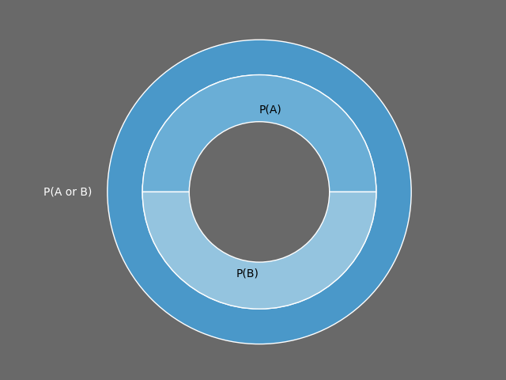
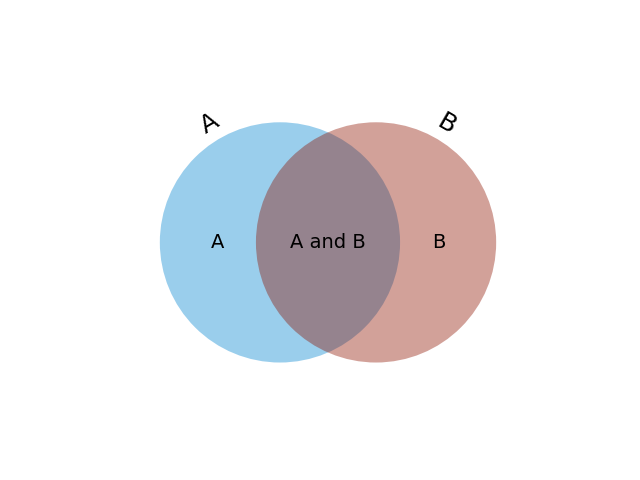

# Language Modeling and Probability
2020-9-18

---
# Probability

- The **probability** of an **event** $e$ has a number of epistemological interpretations
- Assuming we have **data**, we can count the number of times $e$ occurs in the dataset to estimate the probability of $e$, $P(e)$.
$$
P(e)=\frac{\text{count}(e)}{\text{count}(\text{all events})}.
$$

- If we put all events in a bag, shake it up, and choose one at random (called **sampling**), how likely are we to get $e$?

---
# Probability

- Suppose we flip a fair coin
- What is the probability of heads, $P(e=H)$?

---
# Probability

- Suppose we flip a fair coin
- What is the probability of heads, $P(e=H)$?
- We have "all" of two possibilities, $e\in\{H, T\}$.

---
# Probability

- Suppose we flip a fair coin
- What is the probability of heads, $P(e=H)$?
- We have "all" of two possibilities, $e\in\{H, T\}$.
- $P(e=H) = \frac{count(H)}{count(H) + count(T)}$

---
# Probability

- Suppose we have a fair 6-sided die.
 $$\frac{count(s)}{count(1) + count(2) + count(3) + \dots + count(6)}\\
= \frac{1}{1 + 1 + 1 + 1 + 1 + 1} = \frac{1}{6}$$

---
# Probability

- What about a die with on ly three numbers $\{1, 2, 3\}$, each of which appears twice?

- What's the probability of getting "1"?

---
# Probability

- What about a die with on ly three numbers $\{1, 2, 3\}$, each of which appears twice?

- What's the probability of getting "1"?

$$P(e = 1) = \frac{count(1)}{count(1) + count(2) + count(3)}$$

---
# Probability

- What about a die with on ly three numbers $\{1, 2, 3\}$, each of which appears twice?

- What's the probability of getting "1"?

$$P(e = 1) = \frac{count(1)}{count(1) + count(2) + count(3)} \\
= \frac{2}{2 + 2 + 2} = \frac{1}{3}.$$

---
# Probability

- The set of all probabilities for an event $e$ is called a **probability distribution**

- Each die roll is an independent event (Bernoulli trial).

---
# Probability

- Question: Which is greater, $P(HHHHH)$ or $P(HHTHH)$?

---
# Probability

- Question: Which is greater, $P(HHHHH)$ or $P(HHTHH)$?
- Since the events are independent, they're equal

---
# Probability Axioms
1. Probabilities of events must be no less than 0. $P(e)\geq 0$ for all $e$.

2. The sum of all probabilities in a distribution must sum to 1.  That is, $P(e_1) + P(e_2) + \ldots + P(e_n) = 1 $.  Or, more succinctly, 
   $$
   \sum_{e\in E}P(e) = 1.
   $$

3. The probability that one or both of two independent events $e_1$ and $e_2$ will occur is the sum of their respective probabilities.  
   $$
   P(e_1\;\textrm{or}\; e_2) = P(e_1 \cup e_2) = P(e_1) + P(e_2)\; \textrm{when}\;e_1 \cap e_2 = \empty
   $$

---
# Probability Disjunction
Probability space of two events, A and B

---
# Joint Probability

 The probability that two independent events $e_1$ and $e_2$ *both* occur is given by their product.
   $$
   P(e_1 \land e_2) = P(e_1 \cap e_2) = P(e_1)P(e_2)\; \textrm{when}\;e_1 \cap e_2 = \empty
   $$
- Intuitively, think of every probability as a *scaling factor*.
- You can think of a probability as the fraction of the probability space occupied by an event $e_1$.
    - $P(e_1 \land e_2$) is the fraction of of $e_1$'s probability space wherein $e_2$ also occurs.
    - So, if $P(e_1)=\frac{1}{2}$ and $P(e_2)=1/3)$, then $P(e_2,e_2)$ is a third of a half of the probability space or $\frac{1}{3}\times\frac{1}{2}$.

---
# Joint Probability

---
# Probability of a Word

- Given a **corpus** of text, we can estimate the probability of the word "cat" occurring by counting.  If the corpus has 100 word tokens and "cat" appears 10 times, then
$$
P(\textrm{cat}) = \frac{count(\textrm{cat})}{count(\textrm{all words})} = \frac{10}{100} = 0.1
$$

---
# Probability of Words

- Suppose that "cat" appears ten times and "dog" appears five times.  What is $P(\text{``cat  dog''})$, i.e., the probability that we pick "cat" the first time and the next word is "dog"?

---
# Probability of Words

- Suppose that "cat" appears ten times and "dog" appears five times.  What is $P(\text{``cat  dog''})$, i.e., the probability that we pick "cat" the first time and the next word is "dog"?

- Assmuing independence, 
$$
P(\text{``cat dog''}) = P(\text{cat}, \text{dog}) = P(\text{cat})P(\text{dog})=\frac{10}{100}\times\frac{5}{100}=\frac{50}{10000}=.005
$$

---
# Probability of Words

- Is this reasonable?

---
# Probability of Words
- Is this reasonable?

- Some words are more likely to come after others

- When we make independence assumptions, we call it a **bag of words** model

- We can do better

---
# $n$-grams

- An $n$-gram is a sequence of tokens

- The $n$ representes the number of tokens

    - $n$=1, 2, 3 are called unigrams, bigrams, and trigrams, respectively
    - After that, just say the number, e.g., 4-grams.

- Ex: In the sentence, "the quick brown fox jumped over the 

---
# Examples of $n$-gram

Given sentence: "the quick brown fox jumped over the lazy dog"
- unigrams: {the, quick, brown, fox, jumped, ...}
- bigrams: {the quick, quick brown, brown fox, fox jumped, jumped over, ...}
- Trigrams?
- 4-grams?

---
# Conditional Probability

- A **conditional probability** is the probability that one event occurs given that we take another for granted. 

- The probability of $e_2$ given $e_1$ is $P(e_2 \mid e_1)$.
- This is the probability that $e_2$ will occur given that we take for granted that $e_1$ occurs.

---
# Conditional Probability

If $e_1$ and $e_2$ are independent, then 
$$
P(e_2 | e_1) = P(e_2, e_1) \\
= P(e_2 \cap e_1) \\
= P(e_1)P(e_2)\\

= P(e_1 \cap e_2)\\ 
= P(e_1)P(e_2).
$$

---
# Conditional Probability

If $e_1$ and $e_2$ are independent, then 
$$
P(e_2 | e_1) = P(e_2, e_1) \\
= P(e_2 \cap e_1) \\
= P(e_1)P(e_2)\\

= P(e_1 \cap e_2)\\ 
= P(e_1)P(e_2).
$$

- But what if they're not independent?

---
# Conditional Probability

- What if seeing word $w_i$ affects the probability of word $w_{i+1}$?

- Knowing the previous word gives us *more information* with which we can make a *more informative estimate* of the probability

---
# n-gram Probability
- Suppose we've seen the word "computer."  How would we calculate the probability that the next word is "science" given the **context** "computer"?

---
# n-gram Probability
- Suppose we've seen the word "computer."  How would we calculate the probability that the next word is "science" given the **context** "computer"?

$$
P(\textrm{science}\vert \textrm{computer}) = \frac{count(\textrm{computer science})}{count(\textrm{computer})}.
$$ 

- This is the fraction of occurrences of "computer science" to the occurrences of just "computer." 

- This is answering the question, Of the instances of "computer," how many of them are followed by "science?"

---
# n-gram Probability

- Another way of looking at it
$$
P(\textrm{science}\vert \textrm{computer}) = \frac{P(\textrm{computer science})}{P(\textrm{computer})} \\
= \frac{\frac{C(\textrm{computer science})}{C(\textrm{all bigrams})}}{\frac{C(\textrm{computer *})}{C(\textrm{all bigrams})}} \\
= \frac{C(\textrm{computer science})}{C(\textrm{computer})}
$$
where $$*$$ refers to any word.

---
# n-gram Probability

More generally, given words $w_1, w_2$,
$$
P(w_2\vert w_1) = \frac{C(w_1, w_2)}{C(w_1)} = \frac{P(w_1, w_2)}{P(w_1)}
$$

---
# n-gram Probability

Be sure to distinguish between the probability of "computer science" and the probability of "science" given "computer."  This is called a **bigram** probability, because we're using a sequence of two words in our calculation. 

---
# n-gram Probability

- Trigram probability
$$
\frac{P(\textrm{the computer science})}{P(\textrm{the computer})}
$$

- We can keep going to 4-grams, etc.

---
# n-gram Probability

- Trigram probability
$$
\frac{P(\textrm{the computer science})}{P(\textrm{the computer})}
$$

- We can keep going to 4-grams, etc.
- Why not always use huge number of $n$-grams?

---
# n-gram Probability

- The longer a sequence, the less likely it is to occur
-  If $C(\textrm{the computer science})$ is 0---or, worse, $C(\textrm{the computer})$ is 0---our calculations aren't useful. 
- Data sparsity

---
# Probability of a Sentence

- Suppose we want to estimate the probability of Chomsky's famous sentence, "Colorless green ideas sleep furiously."

---
# Probability of a Sentence

- Suppose we want to estimate the probability of Chomsky's famous sentence, "Colorless green ideas sleep furiously."

- How would we measure this as a joint probability?

---
# Probability of a Sentence
- Suppose we want to estimate the probability of Chomsky's famous sentence, "Colorless green ideas sleep furiously."

- How would we measure this as a joint probability?

$$
P(\text{``Colorless green ideas sleep furiously''})
$$

---
# Probability of a Sentence
- Suppose we want to estimate the probability of Chomsky's famous sentence, "Colorless green ideas sleep furiously."

- How would we measure this as a joint probability?

$$
P(\text{``Colorless green ideas sleep furiously''})
$$

- Extremely unlikely; possibly 0.

---
# Probability of a Sentence
- Instead, assume that each word depends only on the previous word (Markov property).
    - Bigram model
- Pad the sentence with special characters`<s>` and `</s>`, so that we know the probability of the first word and the end of the sentence

---
# Probability of a Sentence
With a bigram model,
$$
P(\textrm{<s> colorless kumquat ideas sleep furiously</s>})$$ 
is estimated by 
$$P(\textrm{colorless}\vert \textrm{<s>})P(\textrm{kumquat} \vert \textrm{colorless})P(\textrm{ideas}\vert \textrm{kumquat})P(\textrm{sleep}\vert \textrm{ideas})P(\textrm{furiously} \vert \textrm{sleep})P(\textrm{</s>}\vert\textrm{sleep}).$$

---
# Smoothing
- Zeroes are a problem!
- Also called **pseudocounting**

---
# Smoothing
- Suppose "inexorably" never appears.
- Then $P(\text{inexorably)}) = 0$
- How can we deal with this?

---
# Smoothing
$$
\frac{C(w)}{C(\textrm{all words})},
$$

becomes

$$
\frac{C(w) + 1}{C(\textrm{all words}) + |V|}.
$$

---
# Smoothing
In general,
$$
\frac{C(w)+\alpha}{C(\textrm{all words}) + \alpha |V|}
$$
where $\alpha < 1$