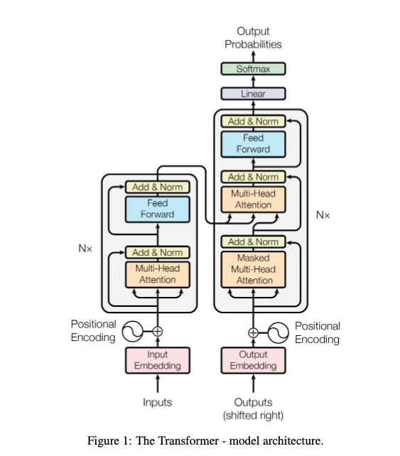

# Transformers Lab

The following explanation is for students who wish to better understand the code, but it is also acceptable for students to skip to the experimental part of the lab.

In this experimental lab, we will revisit the task of a prior homework assignment, IMDB, for which you used feed-forward neural networks and recrrent neural networks to solve.  We’ll now examine some Keras code for implementing the transformer.  The starter code can be found here in `keras-io/examples/nlp/text_classification_with_transformer.py`.  Copy the file to an easily accessible place to edit it.  You can also use Google Collab: https://keras.io/examples/nlp/text_classification_with_transformer/

Recall that a transformer block uses multi-headed self-attention.  Self-attention uses a query, key, and value, where the query is the current focus of attention, the key is some preceding input being compared to the query, and the value is used to compute the output of the query.  The weight matrices, $W^Q, W^K, W^V$  project the input vector $\mathbf{x}_i$ with these weight matrices into a query, key, or value vector:
$$
\mathbf{q}_i=W^Q\mathbf{x_i}; \mathbf{k_i}=W^K\mathbf{x}_i; \mathbf{v}_i=W^V\mathbf{x}_i
$$
Multi-headed self-attention has multiple “heads.”  The word vectors are divided into sections, to which each of the $n$ heads can attend.  These projections are done with weight matrices for each head.  Attention head $i$ has its own $W^K_i, W^Q_i, W^V_i$.  Each of these specialized queries, keys, and values are then combined.

In place of recurrence, transformers have not only multi-headed self-attention, but also **positional encodings** of the same dimension as the word embedding layer.  Positional encodings capture relative position of tokens.

With this in mind, we can examine the transformer block in class `TransformerBlock`, a custom layer, extending  the `Layer` class in Keras.  At initialization, we create a multi-headed attention layer where the key (and, by extension, the query, and the value) are of the same dimension as the words embeddings.

```python
        self.att = layers.MultiHeadAttention(num_heads=num_heads, key_dim=embed_dim)
```

Next we have a feed-forward network with a width the same as that of the embedding dimension with [ReLU](https://en.wikipedia.org/wiki/Rectifier_(neural_networks)) activation, followed two independent [layer normalizers](https://www.tensorflow.org/addons/tutorials/layers_normalizations) and independent dropout rates.

```python
 self.ffn = keras.Sequential(
            [layers.Dense(ff_dim, activation="relu"), layers.Dense(embed_dim),]
        )
```

When called, the transformer attends across input queries and values, both of which come from `inputs`.  The result of the attention then undergoes dropout and normalization before being sent through the feed-forward neural network, which itself has a separate dropout rate.  Finally, attention results and the FFNN outputs are contcatenated and returned.

The `TokenAndPositoinEmbedding` layer class has two embedding layers: the standard word embedding layer, and the positional encoding (layer) embedding.  The original paper uses a formula to calculate relative (normalized) positions, but this is not done here.  The `token_emb` embedding layer is straightforward, taking input `x` as an argument.  The `pos_emb` layer just creates a list from `0` to `maxlen`.  This is concatenated with the word embeddings and resturned a a single vector.

The clasification section of the code is relatively straightforward.  There is a `GlobalAveragePooling1D` layer, which does [global average pooling](https://androidkt.com/explain-pooling-layers-max-pooling-average-pooling-global-average-pooling-and-global-max-pooling/).  The output of the transformer is 2D, and this flattens it to 1D by doing a kind of averaging of adjacent cells in the matrix/tensor.  It can also be thought of a kind of a regularization.  This is not part of the original transformer specification, and it can be replaced with `x = layers.Flatten()(x)` to preserve all of the original information.  MaxPool layers are another option.

Refer to the architectural design from the [original paper](https://arxiv.org/pdf/1706.03762.pdf).  Often, transformer blocks are stacked, just as with recurrent units.

)

# Assignment

######  As with Homework 4, run several experiments on the IMDB data (for a reasonable number of epoch).  Try changing at least two hyperparameters or architectural decisions in the model.  For example, what happens if you change the number of attention heads?  What happens if you remove the pooling or dropout layers?  What happens if you don’t use positional embeddings?  You may find it helpful to use the plotting code from Homework 4’s example code and paste it into your file.