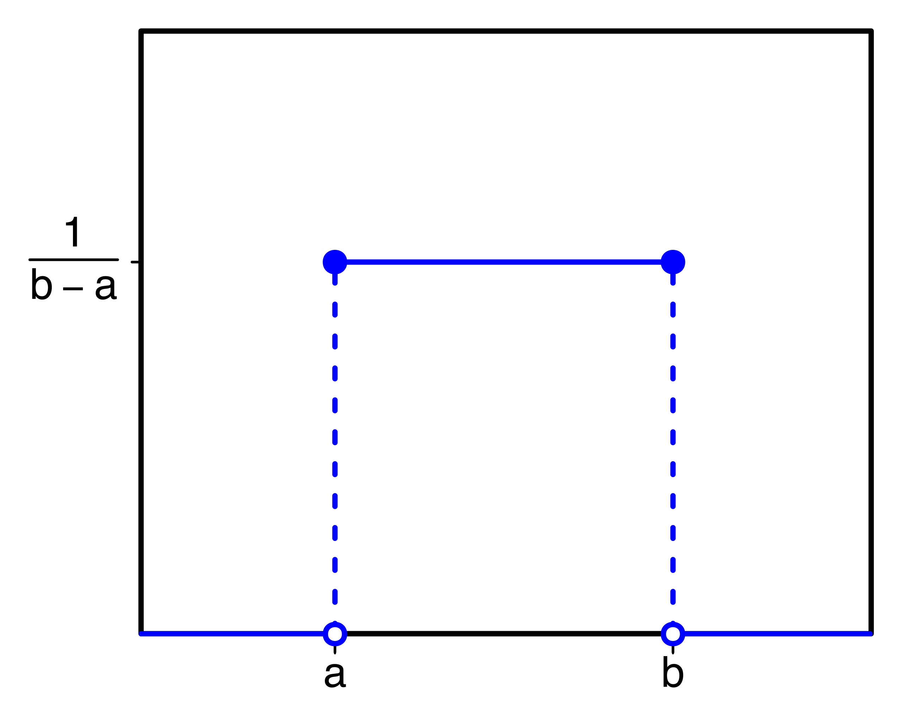

# More Probability
2021-9-8

---
# Probability Distribution Functions

- Ultimately, a probability function is a *mathematical function* called a **probability distribution**.
- Input a value or values and get a probability
 $$P(x)=p$$
 - Some are discrete; others are continuous.
 - All possible inputs must sum to 1.

---
# Probability Distribution Functions
- Like any other function, probability functions can be graphed.
- There are several common distributions.

---
# Probability Distirbution Functions
* Uniform Distribution

---
# Probability Distribution Functions
- Normal/Gaussian Distribution

---
# Conditional Probability Distributions
$$P(X |Y)$$
* Still a probability distribution, as always.
* All inputs must still sum to 1.
* How do we find cumulative probability for continuous vs. discrete distributions?

---
# Joint/Multvariate Probability Distributions
$$P(X,Y)$$

---
# Marginal Probability Distributions
- Given a discrete joint probability distribution function
$$P(X,Y),$$
how would we find
$$P(X)?$$

---
# Marginal Probability Distributions
Given a discrete joint probability distribution function $P(X,Y),$ how would we find
$P(X)?$
- "Marginalize out" the $Y$.
    - Sum up all $y$'s/
- Discrete Case: $p(x)=\sum\limits_{y\in Y} P(x,y)$

---
# Marginal Probability Distributions
Given a discrete joint probability distribution function $P(X,Y),$ how would we find
$P(X)?$
- "Marginalize out" (fix) the $Y$.
- Discrete Case: $p(x)=\sum\limits_{y\in Y} P(x,y)$
- Continuous Case: $p(x)=\int p(x,y)dy$

---
# Marginal Probability Distributions
Given a discrete joint probability distribution function $P(X,Y),$ how would we find
$P(X)?$
- "Marginalize out" (fix) the $Y$.

