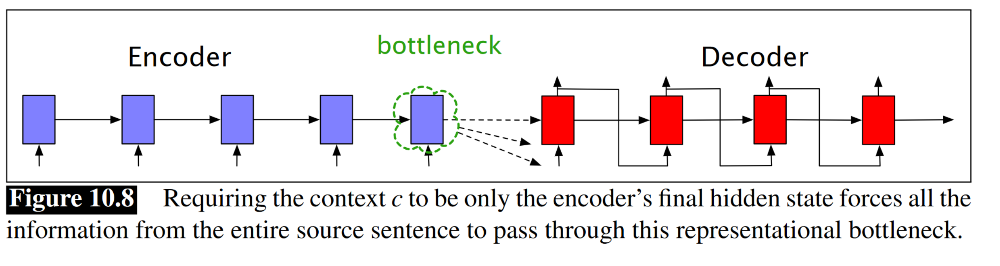
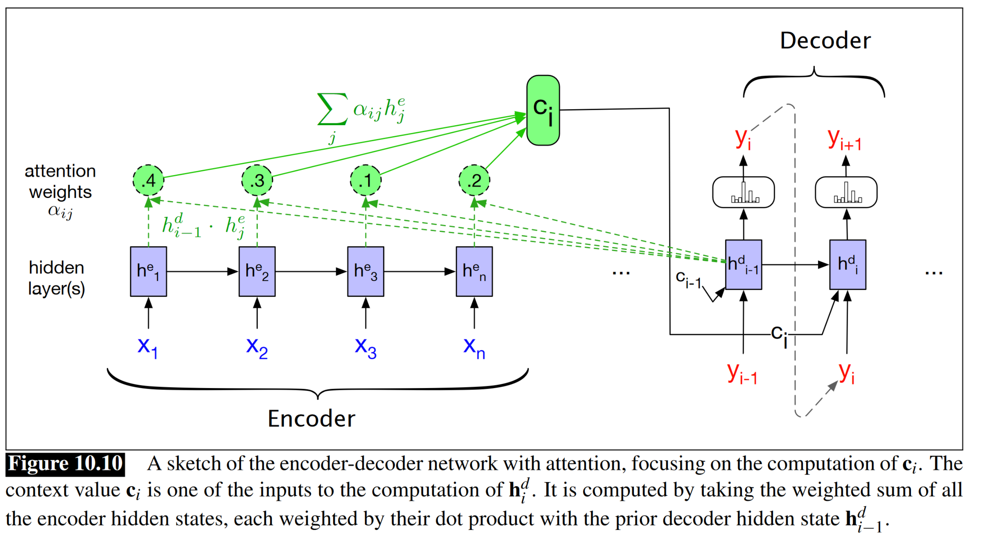
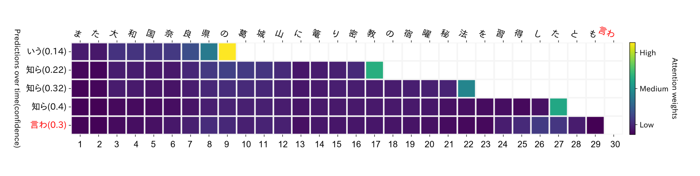
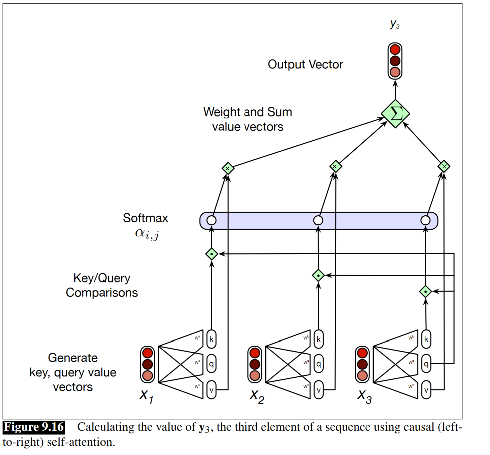
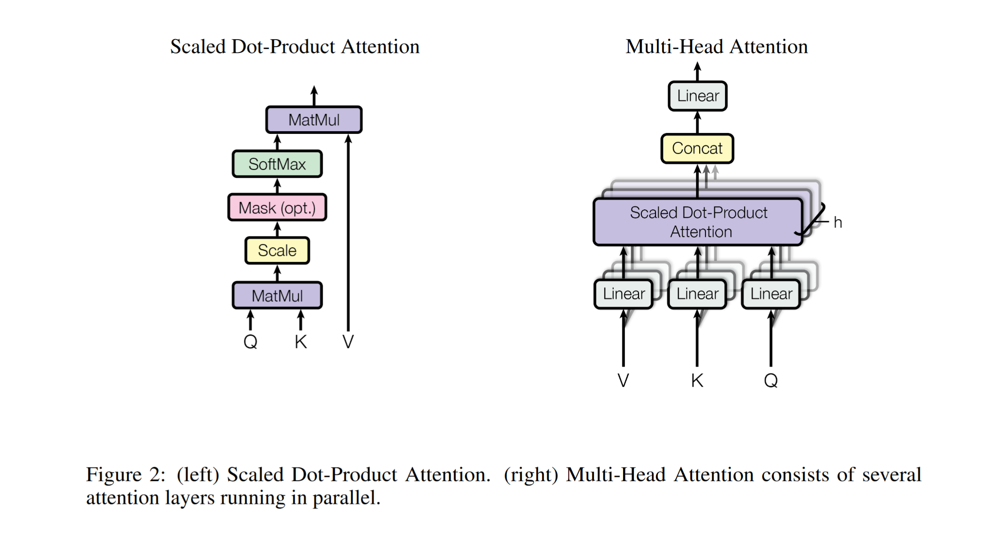
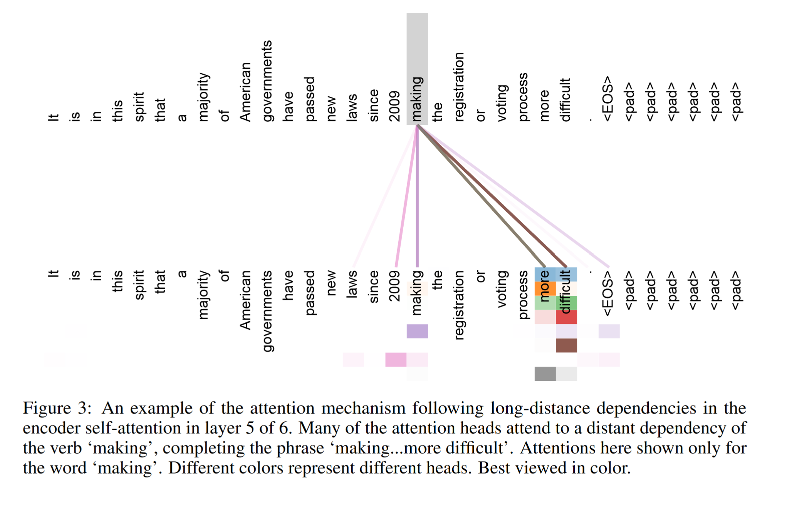
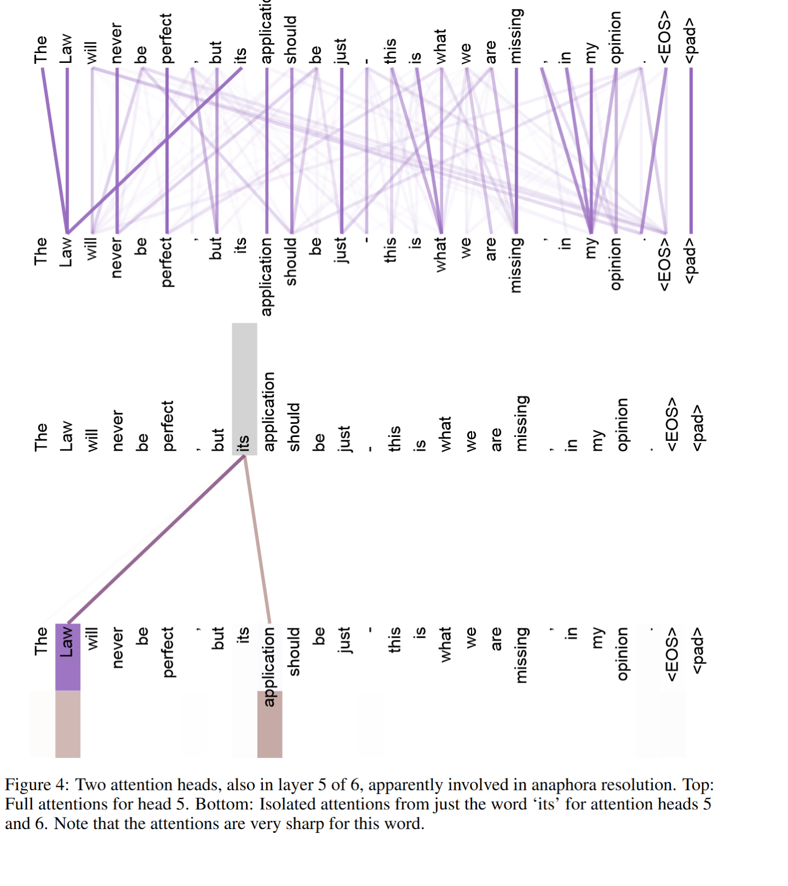
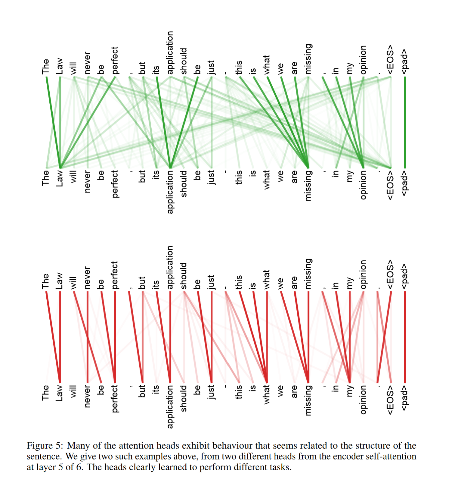

# Attention Mechanism
2021-11-3

---
# Attention Mechanism
- LSTM/GRU networks attmempt to summarize entire input in final hidden state $\mathbf{h}_n.$

- What if we could focus preserve the information from all of the intermittent hidden states and focus on some time steps more than others?

---
# Attention Mechanism
- Consider encoder-decoder model.
- Recall that hidden states are a **context vector**, just as in vanilla RNN.
    $$
    \mathbf{c}=f(\mathbf{h^e_1\cdots \mathbf{h}^e_n}).
    $$
    - Here $e$ is for "encoder."
- $\mathbf{c}_i$ is recomputed at decoding step $i$.
$$
\mathbf{h}^d_i=g(\hat{y}_{i-1},\mathbf{h}^d_{i-1},\mathbf{c_i})
$$
- conditioned on current hidden state, previous decder output
---
# Attention mechanism
- With attention mechanism, we have a *weighted* context vector in the decoder $\mathbf{c}$.
- The weights give more or less "attention" to the hidden states at different time steps.
- Attention mechanism computes a relevance score of each encoder state to decoder state $\mathbf{h}^d_{i-1}$.
$$
\text{score}(\mathbf{h}^d_{i-1},\mathbf{h}^e_{j}) 
$$
for each encoder state $j$.

---
# Attention Mechanism
- Simplest version: dot product attention.
    - Relevance as similarity: how similar encoder state is to decoder state, as measured by dot product
    

---
# Attention Mechanism
- Simplest version: dot product attention.
    - Relevance as similarity: how similar encoder state is to decoder state, as measured by dot product
$$
\text{score}(\mathbf{h}^d_{i-1},\mathbf{h}^e_{j})=\mathbf{h}^d_{i-1}\cdot \mathbf{h}^e_{j}
$$
- Then normalize with softmax to create vector of weights $\alpha_{ij}\mathbf{h}^e_j$,
where $\alpha_{ij}=\text{softmax}(\text{score}(\mathbf{h}^d_{i-1},\mathbf{h}^e_{j})),  \forall j\in e$.
- We end up with a weighted context vector according to the needs of the decoder, 
$$
\mathbf{c}_i=\sum_j \alpha_{ij}\mathbf{h}^e_j.
$$

---

---
# Attention Mechanism
- It's possible to create more complex attention mechanisms.
- One example: compute relevance of each encoder hidden state to each decoder hidden state by sets of weights to individual *scores* themselves.
$$
\text{score}(\mathbf{h}^d_{i-1},\mathbf{h}^e_{j})=\mathbf{h}^d_{i-1}\mathbf{W}_s \mathbf{h}^e_{j}
$$
- New set of weights $\mathbf{W}_s$ parameterize hidden states.
    - Determines which *parts* of each hidden state vector are relevant at the moment.
    - Trained along with everything else.
---

# Attention Mechanism
- Attention mechanism also commonly used in computer vision, as well.
- Can visualize attention weights.
- Some debate over whether NLP attention is "interpretable."
- Attention almost always helps.

---

# Transformers

- "Attention is All You Need" (Vaswani et al., 2018).
- Eschews recurrence.
    - RNN-baesd encoder-decoders have trouble with long sequences
    - E-D models require linearly iterating through input. 
- Relies on multi-headed self-attention

---

# Transformers: Self-attention
- Allows interactions within the input itself.
- Maps inputs $\mathbf{x}$ to outputs $\mathbf{y}$ of equal length.
- During training, model has access to *full* input up to the input being considered.

---
# Transformers: Self-attention
- We can *compare* an item $x_i$ to any word before $x_i$ in the input to generate output.
    - Usually dot product attention: larger means more similar.
    

---
# Transformers: Self-attention
 We can *compare* an item $x_i$ to any word before $x_i$ in the input to generate output.
    - Usually dot product attention: larger means more similar.
$$
\alpha_{ij}=\text{softmax}(\text{score}(\mathbf{x}_i,\mathbf{x}_j))
$$
$$
\mathbf{y}_i=\sum_j \alpha_{ij}\mathbf{x}_j.
$$

---
# Transformers: Self-attention
- But self-attention is more complex.
Definitions
- **Query (Q)**: current focus of attention when being compared to other inputs
- **Key (K)**: Some preceding input before the current input (being comparde to it).
- **Value (V)**: used to computer the output for the current focus of attention.
- Store this information in three weight matrices, $W^Q, W^K, W^V$.
    - projeect input $\mathbf{x}$ into represenattion as query, key, or value.
$$
\mathbf{q}_i=W^Q\mathbf{x_i}; \mathbf{k_i}=W^K\mathbf{x}_i; \mathbf{v}_i=W^V\mathbf{x}_i
$$
---
# Transformers: Self-attention
- Now, instead of $\text{score}(\mathbf{x}_i,\mathbf{x}_j)=\mathbf{x}_i\cdot\mathbf{x}_j$, we have:
$$
\text{score}(\mathbf{x}_i,\mathbf{x}_j)=\mathbf{q}_i\cdot\mathbf{k}_j
$$
And 
$$
\alpha_{ij}=\text{softmax}(\text{score}(\mathbf{x}_i,\mathbf{x}_j))
$$
And
$$
 \mathbf{y}_i=\sum_{j\le i} \alpha_{ij}\mathbf{v}_j.
$$
---

# Transformers: Self-attention
- One minor complication: We modify the score function by the seuare root of the dimensionality embedding size to keep them under control.
$$
\text{score}(\mathbf{x}_i,\mathbf{x}_j)=\frac{\mathbf{q}_i\cdot\mathbf{k}_j}{\sqrt{d_k}}
$$

$$
\text{Self-attention}(Q,K,V)=\text{softmax}(\frac{QK^T}{\sqrt{d_k}})V
$$

---
  

---
# Transformers: Self-attention
- Unlie RNNs, calculations are independent and can be done in parallel (during training).
- Faster than RNNs, despite being more powerful.
- Complexity: $O(\text{length}^2 \times \text{dim})$
 vs LSTM $O(\text{length} \times \text{dim}^2)$

---
# Transformers: Multi-head Self-Attention
 - Self-attention layers, called heads, with their own respective parameters.
 - Each head can account for different kinds of relationships.
 - Each head has its own $W^K_i, W^Q_i, W^V_i$.
 - The outputs are combined and and reduced to dimension $d$.

---
 

---
  

---
  

---
  
