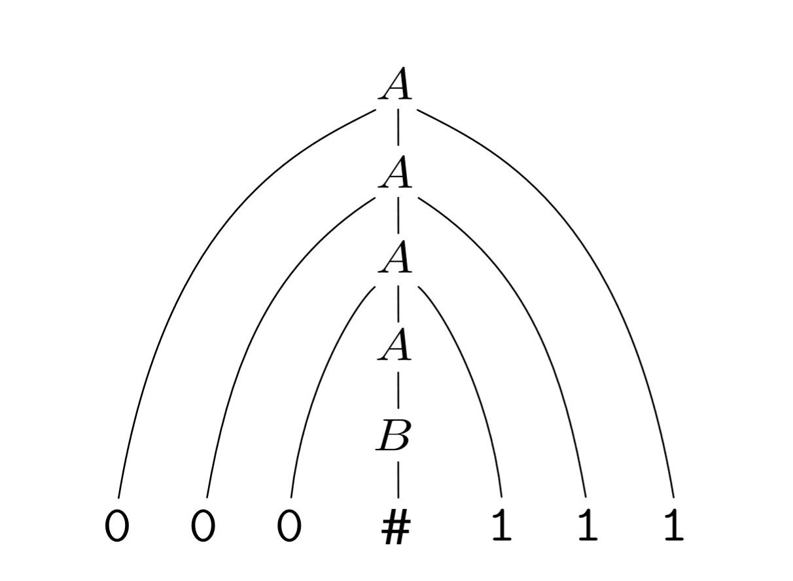

# Context-free Grammars
---
# Context Free Grammars

- We discussed finite state automata and regular expressions at the beginning of the semester.
- Recall that FSAs and regexes are equivalent
    - Infinitely many languages cannot be captured by regexes/FSAs.
    $$
    a^n b^n
    $$ 
- Languages also unrecognizable by pushdown automata (which have a stack) and others.

---
# Context-free Grammars
- A **context-free grammar** (or **phrase-structure grammar**) is more powerful than any formal grammars we have so far covered.
- Discovered by Noam Chomsky in 1950's to capture recursive structure of human language.
- Recognize the set of **context-free languages**.
- Also used in programming languages.

---
# Context-free Grammars

---
# Context-free Grammars
- A CFG $G$ is a 4-tuple where $G=(C,\Sigma,R,S)$.
    - $V$ is a set of *nonterminals*.  In human language, a nonterminal is usually a grammatical category.
    - $\Sigma$ is a set of terminals.  In human language, this is often a word.
    - $R$ is a finite relation $V\times (V\cup \Sigma)^*$ of **rewrite rules** or **productions**.
    - $S$ is the start variable.

---
# Context-free Grammars
- Example grammar $G_1$
$$
A \rightarrow 0A1
$$
$$
A \rightarrow B
$$
$$
B \rightarrow \#
$$

- $A$ and $B$ are variables,
- $A\rightarrow 0A1$ is a production rule.
- $\#$ is a nonterminal 

---
# Context-free Grammars
- Example grammar $G_1$
$$
A \rightarrow 0A1
$$
$$
A \rightarrow B
$$
$$
B \rightarrow \#
$$

Derivation: $A \Rightarrow 0A1 \Rightarrow 00A11 \Rightarrow 00B11 \Rightarrow 000B111 \Rightarrow 000\#111$.

---
# Context-free Grammars
- Example grammar $G_1$
$$
A \rightarrow 0A1
$$
$$
A \rightarrow B
$$
$$
B \rightarrow \#
$$

Derivation: $A \Rightarrow 0A1 \Rightarrow 00A11 \Rightarrow 00B11 \Rightarrow 000B111 \Rightarrow 000\#111$.
- Can also be shown with a **parse tree**.

(Image from Introduction to Theory of Computation by Sipser)

---
---
# Context-free Grammars
- Example grammar $G_1$
$$
A \rightarrow 0A1
$$
$$
A \rightarrow B
$$
$$
B \rightarrow \#
$$

Derivation: $A \Rightarrow 0A1 \Rightarrow 00A11 \Rightarrow 00B11 \Rightarrow 000B111 \Rightarrow 000\#111$.
- Can also be shown with a **parse tree**.
- The language of the grammar $L(G_1)=\{0^n\#1^n\}$

---
# Context-free grammars
- Consider the grammar
$$
S \rightarrow \text{NP } \text{VP}
$$

$$
NP \rightarrow \text{Det N}
$$

$$ 
VP \rightarrow \text{V NP | V}
$$

$$
Det \rightarrow \text{a | the}
$$

$$
NP \rightarrow \text{woman | man | person}
$$

$$
V \rightarrow \text{greets}
$$