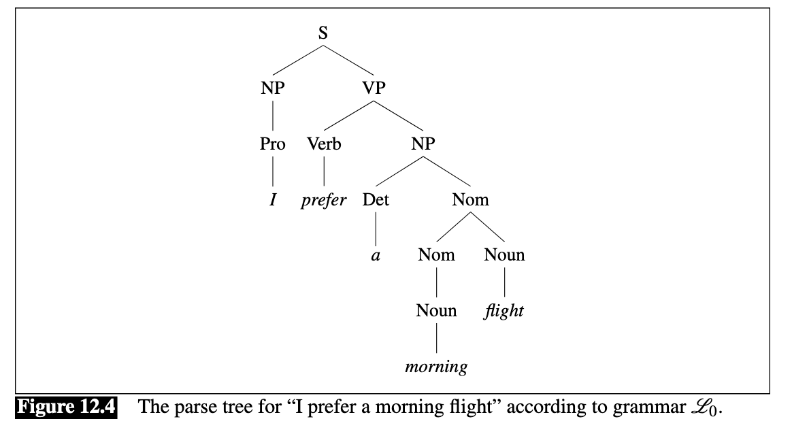
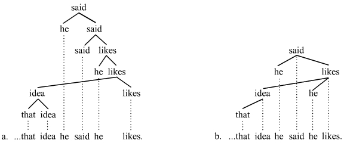
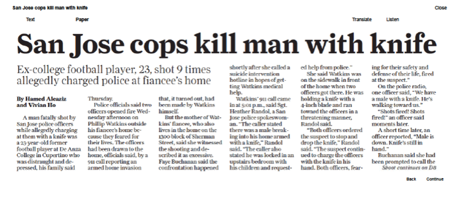
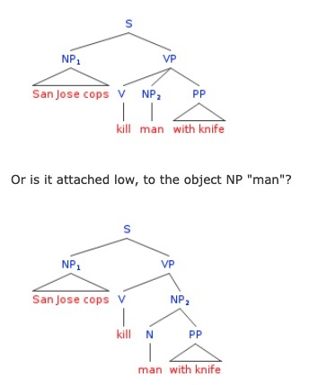

# Context-free Grammars
---
# Context Free Grammars

- We discussed finite state automata and regular expressions at the beginning of the semester.
- Recall that FSAs and regexes are equivalent
    - Infinitely many languages cannot be captured by regexes/FSAs.
    $$
    a^n b^n
    $$ 
- Languages also unrecognizable by pushdown automata (which have a stack) and others.

---
# Context-free Grammars
- A **context-free grammar** (or **phrase-structure grammar**) is more powerful than any formal grammars we have so far covered.
- Discovered by Noam Chomsky in 1950's to capture recursive structure of human language.
- Recognize the set of **context-free languages**.
- Also used in programming languages.

---
# Context-free Grammars

---
# Context-free Grammars
- A CFG $G$ is a 4-tuple where $G=(C,\Sigma,R,S)$.
    - $V$ is a set of *nonterminals*.  In human language, a nonterminal is usually a grammatical category.
    - $\Sigma$ is a set of terminals.  In human language, this is often a word.
    - $R$ is a finite relation $V\times (V\cup \Sigma)^*$ of **rewrite rules** or **productions**.
    - $S$ is the start variable.

---
# Context-free Grammars
- Example grammar $G_1$
$$
A \rightarrow 0A1
$$
$$
A \rightarrow B
$$
$$
B \rightarrow \#
$$

- $A$ and $B$ are variables,
- $A\rightarrow 0A1$ is a production rule.
- $\#$ is a nonterminal 

---
# Context-free Grammars
- Example grammar $G_1$
$$
A \rightarrow 0A1
$$
$$
A \rightarrow B
$$
$$
B \rightarrow \#
$$

Derivation: $A \Rightarrow 0A1 \Rightarrow 00A11 \Rightarrow 00B11 \Rightarrow 000B111 \Rightarrow 000\#111$.

---
# Context-free Grammars
- Example grammar $G_1$
$$
A \rightarrow 0A1
$$
$$
A \rightarrow B
$$
$$
B \rightarrow \#
$$

Derivation: $A \Rightarrow 0A1 \Rightarrow 00A11 \Rightarrow 00B11 \Rightarrow 000B111 \Rightarrow 000\#111$.
- Can also be shown with a **parse tree**.   
Image from Introduction to Theory of Computation by Sipser 

---
# Context-free Grammars
- Example grammar $G_1$
$$
A \rightarrow 0A1
$$
$$
A \rightarrow B
$$
$$
B \rightarrow \#
$$

Derivation: $A \Rightarrow 0A1 \Rightarrow 00A11 \Rightarrow 00B11 \Rightarrow 000B111 \Rightarrow 000\#111$.
- Can also be shown with a **parse tree**.
- The language of the grammar $L(G_1)=\{0^n\#1^n\}$

---
# Context-free grammars

- Consider the grammar

$$
S \rightarrow NP\;VP
$$

$$
NP \rightarrow\; Det\;N
$$

$$ 
VP \rightarrow V\;NP\;|\;V
$$

$$
Det \rightarrow \text{a | the}
$$

$$
NP \rightarrow \text{woman | man | person}
$$

$$
V \rightarrow \text{greets}
$$

---
# Context-free Grammars
- The CFG describes the **syntax** of a language.
- Let's try making a grammar for arithmetic.

---
# Context-free Grammars
- Consider grammar $G_3=(\{S\}, \{a,b\}, R, S)$., with rules R defined as:

$$
S\rightarrow \text{a}S\text{a}\;|SS\;|\;\varepsilon
$$
- What language does this describe?
---
# Context-free Grammars
- Consider grammar $G_4=(V,\Sigma,R,\texttt{<EXPR>})$, with rules $R$:

$$
\texttt{<EXPR>}\rightarrow \texttt{<EXPR>}+\texttt{<TERM>}\;|\texttt{<TERM>}
$$

$$
\texttt{<TERM>}\rightarrow \texttt{<TERM>}\times \texttt{<FACTOR>}
$$

$$
\texttt{<FACTOR>}\rightarrow (\texttt{<EXPR>})\;|\; \text{a}
$$

---
# Context-free Grammars
- A grammar that can generate the same string in two different ways is **ambiguous**.
    - Two different parse trees.
- Consider grammar $G_5$.

$$
\texttt{<EXPR>}\rightarrow \texttt{<EXPR>}+\texttt{<EXPR>}\;|\;\texttt{<EXPRT>}\times\texttt{<EXPR>}\;|\;(\texttt{<EXPR>})\;|\;\text{a}
$$

- Two different parses for $\text{a}+\text{a}\times \text{a}$.
- Some CFLs can only be generated by an ambiguous CFG.
    - Inherently ambiguous.

---
# Context-free Grammars
- In linguistics, grammars are typically expressed in **Chomsky Normal Form** (CNF).
    - Binary branching
    - $\epsilon$-free
- Each production in the form of either:
    $$
    A\rightarrow B\;C
    $$ 

    $$
    A \rightarrow a
    $$
- Any CFG can be expressed in CNF by creating more rules.

---
# Context-free Grammars
 Example: Convert the following grammar to CNF..
 $$
A\rightarrow B\;C\;D
 $$

 ---
# Context-free Grammars
 Example: Convert the following grammar to CNF.
 $$
A\rightarrow B\;C\;D
 $$

 ---
# Context-free Grammars
 Example: Convert the following grammar to CNF.
 $$
A\rightarrow B\;C\;D
 $$

 becomes
 
 $$
A\rightarrow B\;X
 $$

 $$
X \rightarrow C\;D
 $$

---
# Context-free Grammars
- Theory of CFGs devised by Noam Chomsky in 1950s.
- Constantly extended and refiend in generative linguistics.
- Also used for programming languages.

---
# Constituency Grammars
- Let's consider a few basic categories.
 Noun (N): cat
 Determiner: the, a, an
 Verb: ran, is
 Preposition (P): of, in, at
 Adjective (Adj): little
These are combined into phrases.

---
- Basic units can be made up into phrases. 
- Each phrase in called a **constituent**.
    - We generate a **constituency parse** (There are other kinds.)
 For example:
Sentence: $S\rightarrow NP\;VP$
 Noun phrase: $NP\rightarrow N\;|\;Det\;NP\;\text{Adj}P\;N$
 Verb phrase: $VP\rightarrow V\;NP$
 Adjectival Phrase (AdjP): $\text{Adj}P\rightarrow \text{Adj}$
 Prepositional Phrase (PP): $PP\rightarrow P\;NP$

(These are over-simplified.)

---

---
# Constituency Grammars
- In reality, these rules become very complex.
- For example, wh-questions have their own set of rules.

"What flights to you have from Burbank to Tacoma, Washington?"
$$
S\rightarrow Wh-NP\ Aux\;NP\;VP
$$
 Long-distance dependencies.

--- 
# Constituency Grammars
 Revisiting Ambiguity
- A common ambiguity is the **prepositional phrase (PP) attachment ambiguity**.
 The following is an example from the Language Log blog (2015-2-14).

---

  

---
# Constituency Grammars
Agreement
- This flight vs. These flights
- The man walked his dog.
 