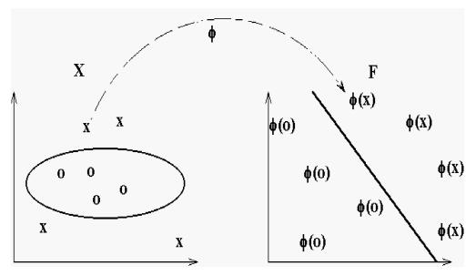

# Kernel Methods
2022-2-21

---
# Kernel Methods
- So far, we have only been able to classify (approximately) linearly separable datasets.
- Support vector machines can get around this by using soft SVMs.
- Is there another way we've discussed for getting around this?
---

# Kernel Methods
- So far, we have only been able to classify (approximately) linearly separable datasets.
- Support vector machines can get around this by using soft SVMs.
- Is there another way we've discussed for getting around this?
    - In our discussion of polynomial regression, we added new features.

---
# Kernel Methods
#### Review: Polynomial Features

- Given features $a$ and $b$, adding polynomial features of degree $d$ adds all possible combinations of features up to degree $d$.  
For degree $3$:

$$
a, b, a^2, b^2 a^2b, ab^2, a^2b^2, a^3, b^3, ab^3, a^3b^3
$$

---
# Kernel Methods
#### Review: Polynomial Features

- Given features $a$ and $b$, adding polynomial features of degree $d$ adds all possible combinations of features up to degree $d$.  
For degree $3$:

$$
a, b, a^2, b^2 a^2b, ab^2, a^2b^2, a^3, b^3, ab^3, a^3b^3
$$

- Given $n$ features, this gives us $\frac{(n+d)!}{n!d!}$ features.
- This remaps data points into higher dimensional space.
- If we have many features, this gives us a huge feature vector.

---
# Kernel Methods
### Review: Polynomial Features

- Given features $a$ and $b$, adding polynomial features of degree $d$ adds all possible combinations of features up to degree $d$.  
For degree $3$:

$$
a, b, a^2, b^2, a^2b, ab^2, a^2b^2, a^3, b^3, a^3b, ab^3, a^3b^3
$$

- Given $n$ features, this gives us $\frac{(n+d)!}{n!d!}$ features.
- Advantage: increases separability of data by increasing dimensionality of feature space.
- Disadvantages: If we have many features, this gives us a huge feature vector; **slow** and memory inefficient; can also lead to overfitting.

---
# Kernel Methods
- Idea: we want to find a **nonlinear decision boundary** with a linear classifier by mapping data $\mathbf{x}$ into a higher dimensional space with a function $K$

---
# Kernel Methods
- Idea: we want to find a **nonlinear decision boundary** with a linear classifier by mapping data $\mathbf{x}$ into a higher dimensional space with a function $K$, giving us a new feature map $\varphi$.

---
# Kernel Methods
- Recall that in the Lagrangian dual formulation of SVMs, we derived an objective function of this form:
$$
\underset{\alpha\ge0, \sum_j\alpha_j y_j=0}{\max}  \sum_{i=1}^n \alpha_i - \frac 1 2 \sum_{i=1}^n\sum_{j=1}^n y_iy_j\alpha_i\alpha_j(\mathbf{x}_i^T\mathbf{x}_j),
$$

- Key: our objective function *only requires the dot product between examples*.
- The $y$ and $\alpha$ terms are scalars.
- Here, $i$ and $j$ compute this for every combination of examples.
- For slack SVMs, bound $\alpha$: $\alpha \in [0,C]$, where $C$ is a hyperparameter.

---
# Kernel Methods
$$
\underset{\alpha\ge0, \sum_j\alpha_j y_j=0}{\max}  \sum_{i=1}^n \alpha_i - \frac 1 2 \sum_{i=1}^n\sum_{j=1}^n y_iy_j\alpha_i\alpha_j\mathbf{x}_i^T\mathbf{x}_j,
$$

- We can do a mapping with a function $K$ that computes a higher-dimensional mapping of $\mathbf{x_i}$ and $\mathbf{x_j}$, replacing the simple product:
$$
\underset{\alpha\ge0, \sum_j\alpha_j y_j=0}{\max}  \sum_{i=1}^n \alpha_i - \frac 1 2 \sum_{i=1}^n\sum_{j=1}^n y_iy_j\alpha_i\alpha_jK(\mathbf{x_i}, \mathbf{x_j}),
$$
where $K(\mathbf{x_i,x_j})=\langle\Phi(\mathbf{x_i}), \Phi(\mathbf{x_j})\rangle$ and $\Phi(\mathbf{x})$ is a mapping into a higher dimensional space.

---
# Kernel Methods
$$
\underset{\alpha\ge0, \sum_j\alpha_j y_j=0}{\max}  \sum_{i=1}^n \alpha_i - \frac 1 2 \sum_{i=1}^n\sum_{j=1}^n y_iy_j\alpha_i\alpha_j\mathbf{x}_i^T\mathbf{x}_j,
$$

- We can do a mapping with a function $K$ that computes a higher-dimensional mapping of $\mathbf{x_i}$ and $\mathbf{x_j}$, replacing the simple product:
$$
\underset{\alpha\ge0, \sum_j\alpha_j y_j=0}{\max}  \sum_{i=1}^n \alpha_i - \frac 1 2 \sum_{i=1}^n\sum_{j=1}^n y_iy_j\alpha_i\alpha_jK(\mathbf{x_i}, \mathbf{x_j}),
$$
where $K(\mathbf{x_i,x_j})=\Phi(\mathbf{x_i}) \cdot \Phi(\mathbf{x_j})$ and $\Phi(\mathbf{x})$ is a mapping into a higher dimensional space.
- But what kind of mapping?
---
# Kernel Methods
$$
\underset{\alpha\ge0, \sum_j\alpha_j y_j=0}{\max}  \sum_{i=1}^n \alpha_i - \frac 1 2 \sum_{i=1}^n\sum_{j=1}^n y_iy_j\alpha_i\alpha_jK(\mathbf{x_i}, \mathbf{x_j}),
$$

- We've replaced $\mathbf{x_i}\cdot\mathbf{x_j}$ with $\Phi(\mathbf{x_i)}\cdot\Phi(\mathbf{x_j})$.
- So we have a dot product of the transformed features, as well.

--- 
# Kernel Methods
Consider the simple kernel $\Phi(\mathbf{x,x'})= \mathbf{x\cdot x' + \|x\|^2 + \|x'\|^2},$
yielding feature map $\varphi(a,b)=(a, b, a^2 + b^2)$ in $\mathbb{R}^3.$

--- 
# Kernel Methods
### Polynomial Kernel
- The polynomial kernel is defined as
$$
\forall \mathbf{x, x'}\in\mathbb{R}^n, K(\mathbf{x},\mathbf{x'}) = (\mathbf{x}\cdot\mathbf{x'} + c) ^d 
$$

--- 
# Kernel Methods
### Polynomial Kernel
- The polynomial kernel is defined as
$$
\forall \mathbf{x, x'}\in\mathbb{R}^n, K(\mathbf{x},\mathbf{x'}) = (\mathbf{x}\cdot\mathbf{x'} + c) ^d 
$$

Consider the polynomial kernel of degree $2$ (quadratic kernel).
$$
K(x,y) = \left(\sum_{i=1}^n x_i y_i + c\right)^2 = 
\sum_{i=1}^n \left(x_i^2\right) \left(y_i^2 \right) + 
\sum_{i=2}^n \sum_{j=1}^{i-1} \left( \sqrt{2} x_i x_j \right) \left( \sqrt{2} y_i y_j \right) 
+ \sum_{i=1}^n \left( \sqrt{2c} x_i \right) \left( \sqrt{2c} y_i \right) + c^2,
$$

--- 
# Kernel Methods
### Polynomial Kernel
- The polynomial kernel is defined as
$$
\forall \mathbf{x, x'}\in\mathbb{R}^n, K(\mathbf{x},\mathbf{x'}) = (\mathbf{x}\cdot\mathbf{x'} + c) ^d 
$$

Consider the polynomial kernel of degree $2$ (quadratic kernel).
$$
K(\mathbf{x,x'}) = \left(\sum_{i=1}^n x_i {x'}_i + c\right)^2 = 
\sum_{i=1}^n \left(x_i^2\right) \left({x'}_i^2 \right) + 
\sum_{i=2}^n \sum_{j=1}^{i-1} \left( \sqrt{2} x_i x_j \right) \left( \sqrt{2} {x'}_i {x'}_j \right) 
+ \sum_{i=1}^n \left( \sqrt{2c} x_i \right) \left( \sqrt{2c} {x'}_i \right) + c^2,
$$
giving us the feature map $\Phi(\mathbf{x}) = \langle x_n^2, \ldots, x_1^2, \sqrt{2} x_n x_{n-1}, \ldots, \sqrt{2} x_n x_1, \sqrt{2} x_{n-1} x_{n-2}, \ldots, \sqrt{2} x_{n-1} x_{1}, \ldots,c \rangle$

---

### Polynomial Kernel
- The polynomial kernel is defined as
$$
\forall \mathbf{x, x'}\in\mathbb{R}^n, K(\mathbf{x},\mathbf{x'}) = (\mathbf{x}\cdot\mathbf{x'} + c) ^d 
$$

For example, for $d = 2, n=2$,
$$
\begin{align}
K(x,y) &= (x_1 y_1 + x_2 y_2 +  c)^2
       \\&= 
       \left[
       \begin{matrix}
       x_1^2\\ x_2^2 \\\sqrt{2}x_1 x_2 \\\sqrt{2c}x_1 \\\sqrt{2c}x_1 \\ c
       \end{matrix}
       \right]
       \cdot
       \left[
       \begin{matrix}
       y_1^2\\ y_2^2 \\\sqrt{2}y_1 y_2 \\\sqrt{2c}y_1 \\\sqrt{2c}y_1 \\ c
       \end{matrix}
       \right]
       \cdot
\end{align}
$$

---

Image from <a href = "https://cs.nyu.edu/~mohri/mls/ml_kernel_methods.pdf">Mohri.</a>

--- 
# Kernel Methods
### Polynomial Kernel
- The polynomial kernel is defined as
$$
\forall \mathbf{x, x'}\in\mathbb{R}^n, K(\mathbf{x},\mathbf{x'}) = (\mathbf{x}\cdot\mathbf{x'} + c) ^d 
$$

Consider the polynomial kernel of degree $2$ (quadratic kernel).
$$
K(\mathbf{x,x'}) = \left(\sum_{i=1}^n x_i {x'}_i + c\right)^2 = 
\sum_{i=1}^n \left(x_i^2\right) \left({x'}_i^2 \right) + 
\sum_{i=2}^n \sum_{j=1}^{i-1} \left( \sqrt{2} x_i x_j \right) \left( \sqrt{2} {x'}_i {x'}_j \right) 
+ \sum_{i=1}^n \left( \sqrt{2c} x_i \right) \left( \sqrt{2c} {x'}_i \right) + c^2,
$$
giving us the feature map $\Phi(\mathbf{x}) = \langle x_n^2, \ldots, x_1^2, \sqrt{2} x_n x_{n-1}, \ldots, \sqrt{2} x_n x_1, \sqrt{2} x_{n-1} x_{n-2}, \ldots, \sqrt{2} x_{n-1} x_{1}, \ldots,c \rangle$

 - Isn't this the same problem we had before?

--- 
# Kernel Methods
- Remember that our objective original objective function used the dot product $\mathbf{x\cdot x'}$, where $\mathbf{x'}$ is a support vector, and we just replaced it with $K(\mathbf{x},\mathbf{x'}$) which is *also* a dot product $\Phi(\mathbf{x})\cdot\Phi(\mathbf{x'})$ in a *higher dimensional space.*
    
--- 
# Kernel Methods
- Remember that our dual objective function used the dot product $\mathbf{x\cdot x'}$, where $\mathbf{x'}$ is a support vector, and we just replaced it with $K(\mathbf{x},\mathbf{x'}$) which is *also* a dot product $\Phi(\mathbf{x})\cdot\Phi(\mathbf{x'})$ in a *higher dimensional space.*
- We *only* need the dot product in either case.
    - We need not actually compute the features.
    - When we compute $\Phi(\mathbf{x})\cdot\Phi(\mathbf{x'})$, the result will be the same *as though we had* computed all of these features.
        - Instead, we do so implicitly, for free.

---
# Kernel Methods
### Prediction
- Originally, our dual prediction function was
$$
\hat{y} = h(\mathbf{x}) = \text{sign}\left(\sum_i \alpha_iy_i \mathbf{x_i}\cdot\mathbf{x} + b \right), \text{ where } \mathbf{x_i} \text{ are support vectors}.
$$
Again, just swap one dot product for another:
$$
\hat{y} = h(\mathbf{x}) = \text{sign}\left(\sum_i \alpha_iy_i K({\mathbf{x_i}},\mathbf{x}) + b \right).
$$

---
# Kernel Methods
### Gaussian (Radial Basis Function) Kernel
$$
K(\mathbf{x}, \mathbf{x'}) = \exp\left(-\frac{\|\mathbf{x} - \mathbf{x'}\|^2}{2\sigma^2}\right)
$$
- Numerator: squared Euclidean distance
- $\sigma$ is a free parameter.
Alternate definition:
$$
K(\mathbf{x}, \mathbf{x'}) = \exp(-\gamma\|\mathbf{x} - \mathbf{x'}\|^2),
$$
where $\gamma=\frac{1}{2\sigma^2}$.

---
# Kernel Methods
### Gaussian (Radial Basis Function) Kernel
$$
K(\mathbf{x}, \mathbf{x'}) = \exp\left(-\frac{\|\mathbf{x} - \mathbf{x'}\|^2}{2\sigma^2}\right)
$$
- Numerator: squared Euclidean distance
- $\sigma$ is a free parameter.
Alternate definition:
$$
K(\mathbf{x}, \mathbf{x'}) = \exp(-\gamma\|\mathbf{x} - \mathbf{x'}\|^2),
$$
where $\gamma=\frac{1}{2\sigma^2}$.
- Question: how many features would this be?

---
# Kernel Methods
### Gaussian (Radial Basis Function) Kernel
$$
K(\mathbf{x}, \mathbf{x'}) = \exp\left(-\frac{\|\mathbf{x} - \mathbf{x'}\|^2}{2\sigma^2}\right)
$$
- Numerator: squared Euclidean distance
- $\sigma$ is a free parameter.
Alternate definition:
$$
K(\mathbf{x}, \mathbf{x'}) = \exp(-\gamma\|\mathbf{x} - \mathbf{x'}\|^2),
$$
where $\gamma=\frac{1}{2\sigma^2}$.
- Question: how many features would this be? Infinitely many!

---
# Kernel Methods:
### RBF Kernel
Let $\sigma=1.$  Then,
$$
\begin{alignat}{2} 
\exp\left(-\frac{1}{2}\|\mathbf{x} - \mathbf{x'}\|^2\right)
&= \exp(\frac{2}{2}\mathbf{x}^\top \mathbf{x'} - \frac{1}{2}\|\mathbf{x}\|^2  - \frac{1}{2}\|\mathbf{x'}\|^2)\\
&= \exp(\mathbf{x}^\top \mathbf{x'}) \exp( - \frac{1}{2}\|\mathbf{x}\|^2) \exp( - \frac{1}{2}\|\mathbf{x'}\|^2) \\
&= \sum_{j=0}^\infty \frac{(\mathbf{x}^\top \mathbf{x'})^j}{j!} \exp\left(-\frac{1}{2}\|\mathbf{x}\|^2\right) \exp\left(-\frac{1}{2}\|\mathbf{x'}\|^2\right)\\
&= \sum_{j=0}^\infty \sum_{\sum n_i=j} 
\exp\left(-\frac{1}{2}\|\mathbf{x}\|^2\right) 
\frac{x_1^{n_1}\cdots x_k^{n_k} }{\sqrt{n_1! \cdots n_k! }} 
\exp\left(-\frac{1}{2}\|\mathbf{x'}\|^2\right) 
\frac{{x'}_1^{n_1}\cdots {x'}_k^{n_k} }{\sqrt{n_1! \cdots n_k! }} 
\end{alignat}
$$
- But we don't have to compute any of this.

---
# Kernel Methods

Image from <a href = "https://scikit-learn.org/stable/auto_examples/svm/plot_iris_svc.html#sphx-glr-auto-examples-svm-plot-iris-svc-py">scikt-learn documentation.</a>