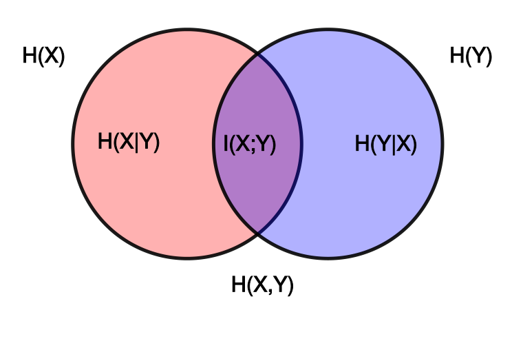

# Decision Tree Basics
2022-2-23

---
# Decision Trees
- Decision trees are among the simplest classes machine learning algorithms.
- Unlike several other algorithms, predictions are easily interpretable.
- There are several algorithms for building decision trees, but they tend to be fundamentally similar.
- Understanding the basics is important for more complex algorithms.

---
# Decision Trees
- Trees built automatically from data.
- **Decision nodes** determine next node base don example.
- **Leaves** determine class (and possibly probability).
- Easily auditable (white box) model.


---

# Decision Trees
- How do we build a decision tree form data?
    - Two common algorithms: ID3 and C4.5.
    - Create splitting nodes based on **information gain**.


---
# Information Gain
Recall that **entropy** is a measure of uncertainty.

$$
\begin{align}
H(X) &= -\sum_{i=1}^n \mathrm{P}(x_i) \log \mathrm{P}(x_i)\\
&= \mathbb{E}\left[\log\left( \frac{1}{p(X)}\right) \right] 

\end{align}
$$

- probability weighted average log probability
- average number of bits to encode a message
- higher entropy means more uncertainty
    - lower probability events contain more information (more surprising)

---
# Information Gain
- Recall: pointwise **mutual information**  is the information learned about one event by observing another.  Mutual information is the expected value of this.

- Information shared by X and Y.
 - How knowing one variable reduces uncertainty of another.

$$
 \mathbb{I}(X; Y) = \sum_{y \in \mathcal Y} \sum_{x \in \mathcal X} p(x, y) \log\left(\frac{p(x, y)}{p(x)\,p(y)}\right)
$$

---
# Information Gain


- Recall: **Conditional entropy** measures how much information you need to describe $y$ if you already know $x$.
     - Uncertainty about Y when X is known.
$$
\begin{align}
\mathbb{H}(Y|X)\ &= -\sum_{x\in\mathcal X, y\in\mathcal Y}p(x,y)\log \frac {p(x,y)} {p(x)}\\
                &= \sum_{x,y}p(x,y) \log p(y|x) \\
                &= -\mathbb{E}[\log p(y|x)]
\end{align}
$$

---
# Information Gain
- In a decision tree, we can create splitting nodes based on **information gain**.
    - i.e., how much do we reduce uncertainty/entropy (gain information) by splitting?
    - This is the difference in entropy.
    - If we know a feature value $v$ for feature $a$, how much information to we gain over the training set entropy?

---

# Information Gain
- Let be a set of training examples $T$, where each example is of the form $(\mathbf{x},y)=\{(x_1,\ldots,x_k,y\}$ and $x_a$ is the value of the $a$th feature value.  
- For a value $\nu$ taken by feature $v$, the let $S_a{(v)} = \{\textbf{x}\in T|x_a=v\}$ be the set of training inputs $T$ for which feature $a$ equals $v.

Then the information gain for $T$ is the difference between the training set entropy $\mathbb{H}(T)$ and the conditional entropy $\mathbb{H}(T|a)$:

$$
\begin{align}
  IG(T,a) = \mathbb{H}(T|a)&= \sum_{v\in \mathrm{vals}(a)} {\frac{|S_a{(v)}|}{|T|}
 \cdot \mathbb{H}\left(S_a{\left(v\right)}\right)}\\
 &= \mathbb{H}(T) - \mathbb{H}(T|a).
 \end{align}
$$

---

# Information Gain
- Let be a set of training examples $T$, where each example is of the form $(\mathbf{x},y)=\{(x_1,\ldots,x_k,y\}$ and $x_a$ is the value of the $a$th feature value.  
- For a value $\nu$ taken by feature $v$, the let $S_a{(v)} = \{\textbf{x}\in T|x_a=v\}$ be the set of training inputs $T$ for which feature $a$ equals $v.

Then the information gain for $T$ is the difference between the training set entropy $\mathbb{H}(T)$ and the conditional entropy $\mathbb{H}(T|a)$:

$$
\begin{align}
  IG(T,a) = \mathbb{H}(T|a)&= \sum_{v\in \mathrm{vals}(a)} {\frac{|S_a{(v)}|}{|T|}
 \cdot \mathbb{H}\left(S_a{\left(v\right)}\right)}\\
 &= \mathbb{H}(T) - \mathbb{H}(T|a).
 \end{align}
$$
- Tells us how informative feature $a$ is about the class.

---
# Information Gain

- You can think of information gain as uncertainty or impurity.
    - Determines how a decision tree splits the data.
    - An impure data set has more noise.

---
# Information Gain

- Parent node has collection of cancer/non-cancer samples $C, $NC$.
- Use IG to determine how good the splitting of the nodes is:
$$
IG= \mathbb{H}(\text{t}) - \frac{1}{2}\left[ \mathbb{H}(t_L) + \mathbb{H}(t_R) \right]
$$

- entropy of parent minus average entropy of children

---
# Skp the slide
 <div class="columns">
<div>

## Cancer Data with Gene Mutation Features

| Samples | $x_1$ | $x_2$ | $x_3$ | $x_4$ |
|---------|-------|-------|-------|-------|
| C1      | 1     | 1     | 1     | 0     |
| C1      | 1     | 1     | 0     | 1     |
| C3      | 1     | 0     | 1     | 1     |
| C4      | 0     | 1     | 1     | 0     |
| NC1     | 0     | 0     | 0     | 0     |
| NC2     | 0     | 1     | 0     | 0     |
| NC3     | 1     | 1     | 0     | 0     |

</div>

<div>

## IG Calculation
Entropy of parent node:
$$
\mathbb{H}(t) = -[p(C,t)]
$$

</div>

---
# ID3 Decision Tree Algorithm
1. Calculate entropy of every attribute $a$ of data sample $S$.
2. Partition $S$ into subsets using attribute that minimizes entropy after splitting (maximizes information gain).
3. Make a new node containing this attribute.
4. Recursively repeat on subsets of remaining attributes.

- Basic idea: a greedy heuristic performing a best-first search for locally optimal entropy values
- Use IG to determine how much uncertainty on $S$ was reduced after splitting $S$ on attribute $A$.

---
# ID3 Decision Tree Algorithm
```
ID3 (Examples, Target_Attribute, Attributes)
    Create a root node for the tree
    If all examples are positive, Return the single-node tree Root, with label = +.
    If all examples are negative, Return the single-node tree Root, with label = -.
    If number of predicting attributes is empty, then Return the single node tree Root,
    with label = most common value of the target attribute in the examples.
    Otherwise Begin
        A ← The Attribute that best classifies examples.
        Decision Tree attribute for Root = A.
        For each possible value, vi, of A,
            Add a new tree branch below Root, corresponding to the test A = vi.
            Let Examples(vi) be the subset of examples that have the value vi for A
            If Examples(vi) is empty
                Then below this new branch add a leaf node with label = most common target value in the examples
            Else below this new branch add the subtree ID3 (Examples(vi), Target_Attribute, Attributes – {A})
    End
    Return Root
  ```

---
# C4.5 Decision Tree Algorithm
- Based on ID3
- Adds support for continuous features values by using thresholds.
- Allows different costs
- Allows tree pruning to remove unnecessary branches.
