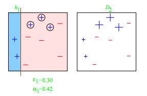

# Emsemble Learning
2022-3-14

---
# Ensemble Learning

* **Ensemble methods** are machine learning techniques that combine several learners to former a stronger meta-learner.

---
# Ensemble Learning
## Voting
- A **voting** classifier takes $k$ different traiend classifiers and has them vote on the correct label.
- Voting often works well, even if underlying classifiers are **weak learners**.

---
# Ensemble Learning
## Voting
- A **voting** classifier takes $k$ different traiend classifiers and has them vote on the correct label.
- Voting often works well, even if underlying classifiers are **weak learners**, i.e., correct slightly more than half the time.

---
# Ensemble Learning
## Voting
- The Law of Large Numbers says that the average result of a large number of independent trials approaches the expected value of the trial as the number of trials increases.
- Consider flipping a biased coin, $P(H) = .51$ and $P(T)=.49$. 
After 1,000 trials, ~75% chance of majority heads.
- Likewise, if you have 1,000 *indepenent* classifiers (with uncorrelated errors) with 51% accuracy, voting will give ~75% accuracy.
    - In simple case, classifiers not dependent, since training data is the same.

---
# Ensemble Learning
## Hard vs. Soft Voting
- Taking a majority vote is called **hard voting**.
- Choosing the classifier with the highest probability (where applicable) is **soft voting**.

---
# Bagging and Pasting
- Bootstrap aggregatting (**bagging**)  trains the same classifier type on random subsets with repalcement (for the same predictor).
- **Pasting**  trains the same classifier type without replacement (for the same predictor).
- With both bagging and pasting, the predictors then vote.
- Good for using multiple CPU cores (or machines) since processes are independent.

---
# Bagging and Pasting
- You can also sample features, instead of instances.
    - Sampling both features and instances is called the Random Patches method.
    - Sampling only features is called the Random Subspaces method.

---
# Stacking
- Simple idea: instead of using a simple (e.g. voting) to combine classifiers, what else could we do?

---
# Stacking
- Simple idea: instead of using a simple (e.g. voting) to combine classifiers, what else could we do?
- Learn a classifier (blender) that takes predictions of classifiers and uses them as feature to make final predictions.
---
# Random Forests
- A **random forest** is an ensemble of decision trees.
    - Vanilla decision trees use purity or entropy to create splitting nodes based on the most informative features.
    - Random forests instead find the best splitting nodes of a random subset of features.
    - All of the random trees then vote.

---
# Random Forests
- Random forests lose the interpretability of decision trees.
- However, we can determine feature importance by averaging the feature impurity across all decision trees in the forest. 

---
# Boosting
Portions of these slides based on slides by Jordan Boyd-Graber.

---
# Boosting
- **Boosting** combines several **weak learners** into a strong learner.
- A concept class $\mathcal{C}$ is weakly PAC-learnable if there exists an algorithm $\mathcal{A} and a polynomial function $poly(\ldots)$ such that for any $\delta>0$, for all distributions $\mathcal{D}$ on $\mathcal{X}$ and for any target concept $c\in C$, the following holds for any sample size $m\ge poly(\frac{1}{\delta}, n, \text{size}(c)))$:
$$
\underset{S\sim\mathcal{D}^m}{\mathbb{P}}[R(h_S)\le \frac{1}{2} - \gamma] \ge 1-\delta, 
$$
where $h_S$ is the hypothesis returned by $\mathcal{A}$ when trained on sample $S$.
- $A$ is a called a weak learning algorithm.
- $h_S$ is called a base classifier. 

---
# AdaBoost

- The **AdaBoost** (Adaptive Boosting) weights certain training examples more than other and trains an ensemble of classifiers on subsets of data.
 - Each classifier is trained on a subset of data.
- Idea: put more weight on hard cases during training.
- AdaBoost often uses an ensemble of **decision stumps** (decision trees of depth 1) as base classifiers.
- Sequential algorithm: not easily parallelizable.

---
#### Boosting

---
# AdaBoost
## Basic Algorithm
- As usual, assume $\mathcal{Y}=\{-1,1\}$
- Construct distribution $\mathcal{D}_t$ on $(1,\ldots,m)$.
- Find weak learner $h_t$ with small error on $\mathcal{D}_t$.
- Output final classifier $f$.

---
# AdaBoost
## Basic Algorithm
- As usual, assume $\mathcal{Y}=\{-1,1\}$
- Construct distribution $\mathcal{D}_t$ on $(1,\ldots,m)$.
    - Initially, set $\mathcal{D}_t(i) = \frac{1}{m}$
    - Then, $\mathcal{D}_{t+1}(i)\propto \mathcal{D}_t(i)\cdot -\alpha_t y_i h_t(x_i)$, where $\alpha_t=\frac{1}{2}\log \frac{1-\epsilon_t}{\epsilon_t} > 0$.
- Find weak learner $h_t$ with small error on $\mathcal{D}_t$.
- Output final classifier $f$.

---
# AdaBoost
## Basic Algorithm
- As usual, assume $\mathcal{Y}=\{-1,1\}$
- Construct distribution $\mathcal{D}_t$ on $(1,\ldots,m)$.
    - Initially, set $\mathcal{D}_t(i) = \frac{1}{m}$
    - Then, $\mathcal{D}_{t+1}(i)\propto \mathcal{D}_t(i)\cdot -\alpha_t y_i h_t(x_i)$, where $\alpha_t=\frac{1}{2}\log \frac{1-\epsilon_t}{\epsilon_t} > 0$.
- Find weak learner $h_t$ with small error on $\mathcal{D}_t$.
- Output final classifier $f$.
- $\alpha_t$ (dependent on $\epsilon_t$) weights according to strenght of the learner.
- $-y_i h_t(x_i)$ will be bigger with more wrong answers.

---
# AdaBoost: Example
- Construct distribution $\mathcal{D}_t$ on $(1,\ldots,m)$.
    - Initially, set $\mathcal{D}_t(i) = \frac{1}{m}$
    - Then, $\mathcal{D}_{t+1}(i)\propto \mathcal{D}_t(i)\cdot -\alpha_t y_i h_t(x_i)$, where $\alpha_t=\frac{1}{2}\log \frac{1-\epsilon_t}{\epsilon_t} > 0$.
- Find weak learner $h_t$ with small error on $\mathcal{D}_t$.
- Output final classifier $f(\mathbf{x})=\text{sgn}\left (\sum_t \alpha_t h_t(x)\right)$

---
# AdaBoost: Iteration 1
- Construct distribution $\mathcal{D}_t$ on $(1,\ldots,m)$.
    - Initially, set $\mathcal{D}_t(i) = \frac{1}{m}$
    - Then, $\mathcal{D}_{t+1}(i)\propto \mathcal{D}_t(i)\cdot -\alpha_t y_i h_t(x_i)$, where $\alpha_t=\frac{1}{2}\log \frac{1-\epsilon_t}{\epsilon_t} > 0$.
- Find weak learner $h_t$ with small error on $\mathcal{D}_t$.
- Output final classifier $f(\mathbf{x})=\text{sgn}\left (\sum_t \alpha_t h_t(x)\right)$

---
# AdaBoost: Iteration 2
- Construct distribution $\mathcal{D}_t$ on $(1,\ldots,m)$.
    - Initially, set $\mathcal{D}_t(i) = \frac{1}{m}$
    - Then, $\mathcal{D}_{t+1}(i)\propto \mathcal{D}_t(i)\cdot -\alpha_t y_i h_t(x_i)$, where $\alpha_t=\frac{1}{2}\log \frac{1-\epsilon_t}{\epsilon_t} > 0$.
- Find weak learner $h_t$ with small error on $\mathcal{D}_t$.
- Output final classifier $f(\mathbf{x})=\text{sgn}\left (\sum_t \alpha_t h_t(x)\right)$

---
# AdaBoost: Interation 3
- Construct distribution $\mathcal{D}_t$ on $(1,\ldots,m)$.
    - Initially, set $\mathcal{D}_t(i) = \frac{1}{m}$
    - Then, $\mathcal{D}_{t+1}(i)\propto \mathcal{D}_t(i)\cdot -\alpha_t y_i h_t(x_i)$, where $\alpha_t=\frac{1}{2}\log \frac{1-\epsilon_t}{\epsilon_t} > 0$.
- Find weak learner $h_t$ with small error on $\mathcal{D}_t$.
- Output final classifier $f(\mathbf{x})=\text{sgn}\left (\sum_t \alpha_t h_t(x)\right)$

---
# AdaBoost: Final 
- Construct distribution $\mathcal{D}_t$ on $(1,\ldots,m)$.
    - Initially, set $\mathcal{D}_t(i) = \frac{1}{m}$
    - Then, $\mathcal{D}_{t+1}(i)\propto \mathcal{D}_t(i)\cdot -\alpha_t y_i h_t(x_i)$, where $\alpha_t=\frac{1}{2}\log \frac{1-\epsilon_t}{\epsilon_t} > 0$.
- Find weak learner $h_t$ with small error on $\mathcal{D}_t$.
- Output final classifier $f(\mathbf{x})=\text{sgn}\left (\sum_t \alpha_t h_t(x)\right)$

---
# AdaBoost

**function** Adaboost$(S=((x_1, y_1),\ldots, (x_m, y_m)))$
1. Initialize all weights $\alpha_i=\frac{1}{n}$.
2. **for** $i\in[1,M]$:
    - $h_t\leftarrow$ base classifier with small error $\epsilon_t=\mathbb{P}_{i\sim\mathcal{D}_t}[h_t(x_i)\neq y_i]$
    - $\alpha_t\leftarrow \frac{1}{2}\log \frac{1-\epsilon_t}{\epsilon_t}$
    - $Z_t\leftarrow 2[\epsilon_t(1-\epsilon_t)]^{\frac{1}{2}}$ (normalization term)
    - **for** $i\in 1[m]$:
        - $\mathcal{D}_{t+1}(i)\leftarrow \frac{\mathcal{D}_t(i)\exp(-\alpha_t y_i h_t(x_i))}{Z_t}$
8. $f\leftarrow \sum_{t=1}^T\alpha_t h_t$

---
# AdaBoost
### Overfitting?

- We mighty expect overfitting with too many iterations.

---
# AdaBoost
### Overfitting?

- We might expect overfitting with too many iterations.
- Empirically, test error stabilizes.
---
# AdaBoost
### Learning Guarantees
- The empirical error $\hat{R}_S(f)$ decreases exponentially fast with the number of rounds of boosting:
$$
\hat{R}_S(f) \leq \exp\left[-2 \sum_{t=1}^T\left(\frac{1}{2} - \epsilon_t \right)^2  \right]
$$

---
# AdaBoost

$$
\text{VCDim(AdaBoost)}\leq 2(d+1)(T+1)\log[(T+1)e]
$$
- VC dimension related to number of rounds $T$.
- Generalization error should go up
- In practice, this doesn't seem to happen...
### Margin Maximization
- AdaBoost solves a linear program which maximizes an $L_1$ margin (vs. SVM's $L_2$ margin)
---
# AdaBoost
### Equivalence with Coordinate Descent
- It can be shown that AdaBoost is equivalent to coordiante descent on a convext, differentiable function.
- The ensemble function $f$ can be writen as $f=\sum_{j=1}^N \bar{\alpha}_j h_j(x_i)$.
- The objective function is then
$$
F(\mathbf{\bar{\alpha}})=\frac{1}{m}\sum_{i=1}^m e^{-y_i f(x_i)} = \frac{1}{m}\sum_{i=1}^m e^{-y_i \sum_{j=1}^N \bar{\alpha}_j h_j(x_i)$}.
$$
- $F$ is a sum of convex functions and therefore convex.
- Since $\mathbb{1}_{u\le 0} \leq \exp[-u]$ upper bounds the 0-1 loss, $F$ upperbounds $\hat{R}_S(f)$:
$$
\hat{R_S}(f) = \frac{1}{m}\sum_{i=1}^m \mathbb{1}[y_i f(x_i) \geq 0] \leq \frac{1}{m}\sum_{i=1}^m e^{-y_i f(x_i)}
$$
---
# AdaBoost
- There have been critiques of the statistical optimization approaach to AdaBoost and the claim that it needs especially weak learners ([Wyner et al., 2017](https://www.jmlr.org/papers/volume18/15-240/15-240.pdf)).
    - [Wyner et al. (2017)](https://www.jmlr.org/papers/volume18/15-240/15-240.pdf) argue that AdaBoost and random forests perform training data interpolation and averaging, which stabilizes learning.
    - i.e., smooths out effects of noise.

---
# AdaBoost
- Basic algorithm is fast and easy to program.
- Only parameter to tune is $T$.
- No prior knowledge required for weak learners.
- Provably effective if you can find weak learners.
    - Now you only need to do slightly better than random!
- Can be used for many different tasks.
- Sequential, so not easily parallelizable.
