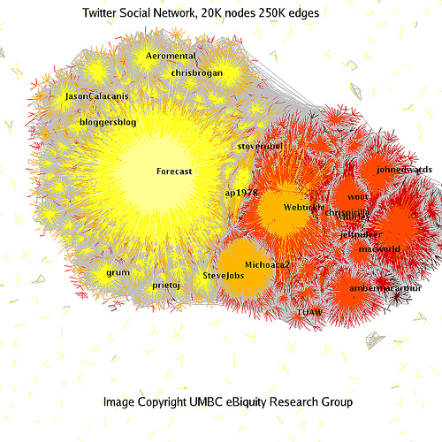
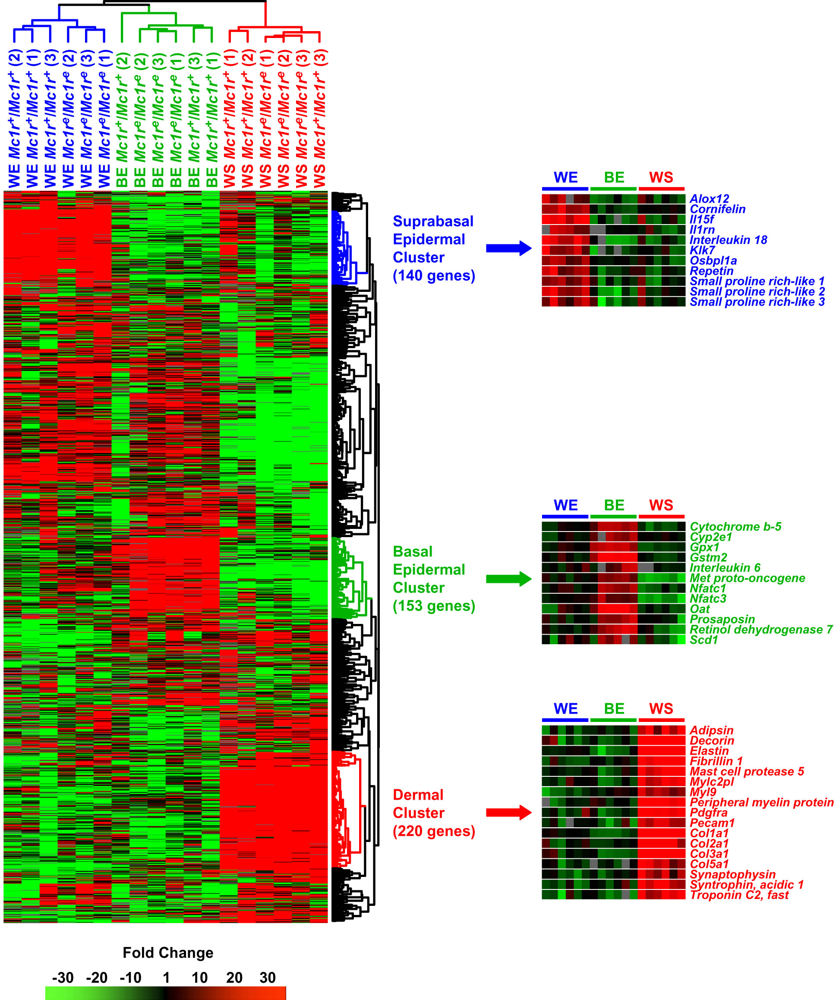
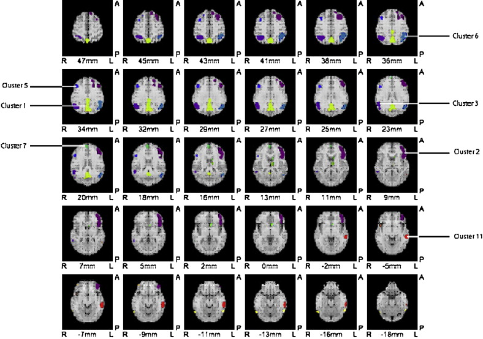
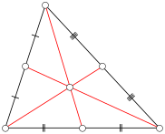
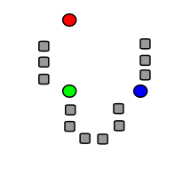
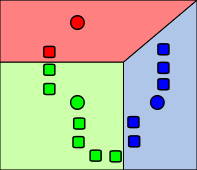
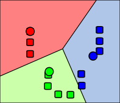
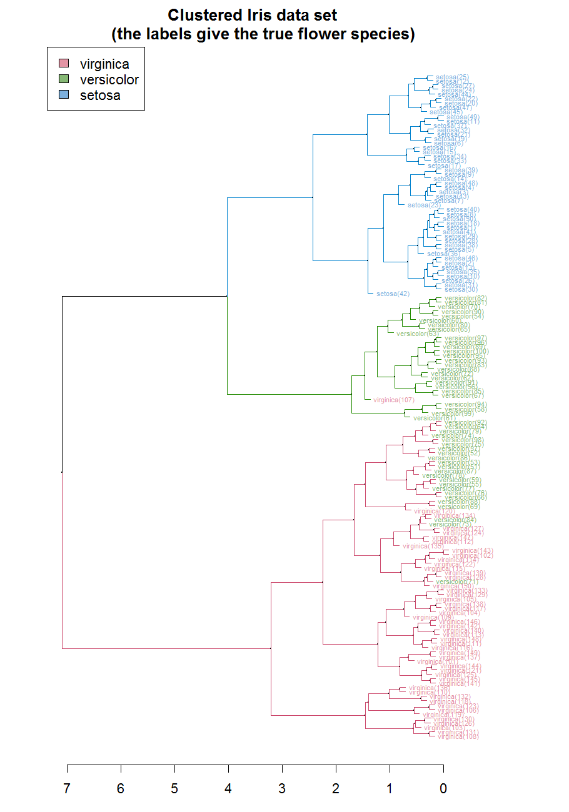

# Clustering
2022-3-21
Portions of these slides adapted from slides by Jordan Boyd-Graber

---
# Unsupervised Learning

- **Unsupervised learning**  learns from unlabled data.
    - i.e., the algorithm lacks the **supervision** of labels
- Examples of unsupervised learning
    - Clustering
        - Centroid-bsed clustering
        - Distribution-based clustering
        - DBSCAN
        - Hierarchical Clustering 
    - Mixture Models
    - Topic Models

---
# Clustering
**Clustering** assigns examples to a group based on their features.

---
# Clustering Use Cases

Social Networks

---
# Clustering Use Cases

Computational Genomics

---
# Clustering Use Cases

PET Scan

---
# $k$-means Clustering
- *centroid*-based method
- The $k$-means clustering algorithm attempts to partition $n$ examples into $k$ clusters.
- $k$-means minimizes the within-cluster variances (equared Euclidean distances)

---
# $k$-means Clustering
Given an initial set of means/centroids, $m_1^{(1)}, \ldots, m_k^{(1)},$
alternate between two steps:
1. **Assignment** Step: Assign each example to the cluster with the nearest centroid (measured by squared Euclidean distance).
2. **Update** Step: Recalculate centroids based on new clusters.
- Stop when assignments no longer change.
- Not guaranteed to find optimum.
- Can use other distance metrics, but this may prevent convergence.

---
# $k$-means Clustering
- The **centroid** of a set of points is the arithmetic mean of all of the points in the set.
- The centroid of an arbitrary set of points $\mathbf{x}_1,\mathbf{x}_2,\ldots,\mathbf{x}_k$ in $\mathbb{R}^n$ is

$$
\mathbf{C} = \frac{\mathbf{x}_1 + \mathbf{x}_2 + \cdots + \mathbf{x}_k}{k}.
$$
e.g., for points $(x_1, y_1),\ldots, (x_n, y_n)$,
$$
C =  \left(\frac{x_1 + x_2 + \cdots + x_n}{n}, \frac{y_1 + y_2 +\cdots + y_n}{n}\right)
$$

---
# $k$-means Clustering
Given an initial (often random) set of means/centroids, $m_1^{(1)}, \ldots, m_k^{(1)},$
alternate between two steps:
1. **Assignment** Step: Assign each example to the cluster with the nearest centroid (measured by squared Euclidean distance).
2. **Update** Step: Recalculate centroids based on new clusters.
- Stop when assignments no longer change.
- Not guaranteed to find optimum.
- Can use other distance metrics, but this may prevent convergence.

---

## $k$-means Simple Example
- **Randomly assign $k=3$ centroids</u>**
1. Assignment Step: Assign each example to the cluster with the nearest centroid (measured by squared Euclidean distance).
2. Update Step: Recalculate centroids based on new clusters.
- Repeat 1 and 2.

---
## $k$-means Simple Example
- Randomly assign $k=3$ centroids
1. **Assignment Step: Assign each example to the cluster with the nearest centroid (measured by squared Euclidean distance).**
2. Update Step: Recalculate centroids based on new clusters.
- Repeat 1 and 2.

---

## $k$-means Simple Example
- Randomly assign $k=3$ centroids
1. Assignment Step: Assign each example to the cluster with the nearest centroid (measured by squared Euclidean distance).**
2. **Update Step: Recalculate centroids based on new cluster.
- **Repeat 1 and 2.**

---

## $k$-means Simple Example
- Randomly assign $k=3$ centroids
1. Assignment Step: Assign each example to the cluster with the nearest centroid (measured by squared Euclidean distance).**
2. Update Step: Recalculate centroids based on new clusters.
- **Repeat 1 and 2.**

---
|$x_1$ | $x_2$ |
|---|---|
| 0.4 | -1.0 |
| -1.0 | -2.2 |
| -2.4 | -2.2 |
| -1.0 | -1.9 |
| -0.5 | 0.6 |
| -0.1 | 1.7 |
| 1.2 |3.3 |
| 3.1 | 1.6 |
| 1.3 | 1.6  |
| 2.0 | 0.8 |

---
# Clustering Evaluation
## Inertia
- $k$-means is minimizing the **inertia** or of the clustering, which is the sum of the distances (**intra-cluster distance**) of each point in a cluster from its centroid.
    - Measure of the coherence of clusters.
    - Low values are better.
$$ 
\sum_{i=0}^n \| p_i - c_i \|^2,
$$
where $c_i$ is te closest centroid to $p_i$.

---
# Clustering Evaluation
## Silhouette Score
- The **silhouette score**  is a real value in [-1,1] that measures the separation of clusters.
    - Ratio of mean intra-cluster dstance to the mean nearest (inter) cluster difference

Let $a$ be the main intra-cluster distance and $b$ the mean nearest-cluster difference for a sample.
Then, the Silhouette score is
$$
\frac{n-a}{\text{max}(a,b)}
$$

---
# Clustering Evaluation
## Dunn Index
- A higher **Dunn index** indicates that clusters are compact and far apart, with low intra-cluster variance.
$$
DI=\frac{\text{lowest inter-cluster distance}}{\text{highest intra-cluster distance}}
$$

$$
\mathit{DI}_m = \frac{ \underset{ 1 \leqslant i < j \leqslant m}{\text{min}} \left.\delta(C_i,C_j)\right.}{ \underset{ 1 \leqslant k \leqslant m}{\text{max}} \left.\Delta_k\right.},
$$
where $m$ is the number of clusters, $\delta(C_i,C-_j)$ is the inter-cluster distance, and $\Delta_k$ is the intra-cluster distance.

---
# $k$-means++
- The simplest initial centroid selection algorithm is to choose points randomly.
    - Random selection of initial leads to non-polynomial time complexity in the worst case.
    - Random selection can lead to arbitrarily bad solutions.
        - Commonly, $k$-means is re-run multiple times.

- There are other initialization methods, e.g., selecting a random point from the dataset to be the centroid.
- The **$k$-means++** algorithm attempts to select initial seeds more effectively.

---
# $k$-means++
- The simplest initial centroid selection algorithm is to choose points randomly.
    - Random selection of initial leads to non-polynomial time complexity in the worst case.
    - Random selection can lead to arbitrarily bad solutions.
        - Commonly, $k$-means is re-run multiple times.

- There are other initialization methods, e.g., selecting a random point from the dataset to be the centroid.
- The **$k$-means++** algorithm attempts to select initial seeds more effectively.

---
# $k$-means++
- The simplest initial centroid selection algorithm is to choose points randomly.
    - Random selection of initial leads to non-polynomial time complexity in the worst case.
    - Random selection can lead to arbitrarily bad solutions.
        - Commonly, $k$-means is re-run multiple times.

- There are other initialization methods, e.g., selecting a random point from the dataset to be the centroid.

---
# $k$-means++
- The **$k$-means++** algorithm attempts to select initial seeds more effectively.
- $k$-means++ attempts to find initial clusters that are more spread out.
- Idea: choose initial point randomly from data
-  Then choose subsequent points with probability inverse to the squared distance from the remaining points.

---
# $k$-means++
Algorithm:
1. Choose center point $c$ at random from $\mathcal{X}$.
  - From each of the remaining points $x$, compute $d(x)$, the distance from the nearest center.
3. Compute a new center $c_i$ from remaining data using weight probability distribution, where the point is chosen proportionally to $d(x)^2$
    - i.e., Set $c_i$ by sampling $x\in \mathcal{X}$ with probability $\frac{d(x)^2}{\sum_{x\in\mathcal{X}}d(x)^2}.$
4.  Repeat steps 2 and 3 until $k$ centers have been chosen.
5. Run standard $k$-means on these initial points.

---
# $k$-means++
- Improves $k$-means significantly in practice.
- Requires $k$ initial passes over training data, which can lead to scalability issues.

---
# Other $k$-means Tweaks
- Accelerated $k$-means ([Elkan, 2013](https://www.aaai.org/Papers/ICML/2003/ICML03-022.pdf))
    - Uses triangle inequality: given points $x, y, z$, $d(x,z)\leq d(x,y) + d(x,z)$ to bound distances.
    - Skips unnecessary distance calculations.
- Minibatch $k$ means [(Sculley, 2010)](https://www.eecs.tufts.edu/~dsculley/papers/fastkmeans.pdf)
    - Uses **minibatches** to shift centroids more gradually
    - uses less memory, facilitates larger datasets
    - Converges faster 

---
# Other Clustering Methods
- Density-based spatial clustering of applications with noise (**DBSCAN**) is a *non-parametric*, density-based clustering algorithm.

    - No need to specify $k$
    - Robust to outliers
    - Optimized for use in relational databases

---
# DBSCAN

Given points to be clustered:
Terminology:
- **Core point**: point $p$ with at least `minPoints` points that are within distance $\epsilon$
- **Directly reachable point**: point $q$ within distance $\epsilon$ from *core* point $p$
- **Reachable point**: point $q$ that can be reached through a series of (core) points directly reachable to each other.
- All points not reachable from any other point are **noise** points or **outliers**.
    (All points on the path must be core points).
- A **cluster** is made of all (core or non-core) points reachable from a core point $p$.
- Non-core points form *edges* since they can't be used to reach other poitns.

---
# DBSCAN
Example, `minPoints = 4`.
- Point $A$ and red points are **core points**.
    - Points have an $\epsilon$ radius with $\geq4$ points.
- Red cluster formed when core points reachable one another.
- $B$ and $C$ are not core points but are **reachable**.
    - Also part of red cluster.
- $N$ is not reachable (noise).

---
# DBSCAN

Basic algorithm:
1. For every point, identify points in $\epsilon$ neighborhood.
2. Identify core points $Q$ with $\geq \texttt{minPoints}$ neighboars.
3. For every core point $p\in P$ find connected core points in $P$.
4. Assign non-core points within $\epsilon$-distance of core points to clusters.
    - Remaining points are noise.

---
# DBSCAN
- Awarded Test of Time Award in 2014 at KDD.
- Worst-case complexity of $O(n^2)$.
    - With accelerated indexing structure (e.g., R* tree) executing neighborhood queries in $O(\log n)$, complexity of $O(n \log n)$.
- Only two parameters to set: $\epsilon, \texttt{minPoints}$.
- One version of the **Curse of Dimensionality** can apply for high-dimensional data when using Euclidean distance.
    - When using many features, there may not be much difference between distance, even if feature values diverge acorss same dimensions.
        - Depends on data.

---
## Hierarchical Clustering

- With **hierarchical clustering**, we can have subclusters.
    - **Agglomerative Clustering:** bottom-up approach where clusters start at single points and merge.
    - **Divisive Clustering**: top-down approach all data start in same cluster and splits ar performed recursively.

---
# Gaussian Mixture Models