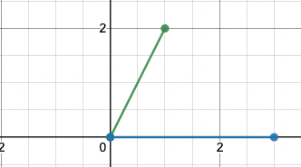
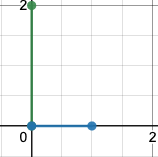
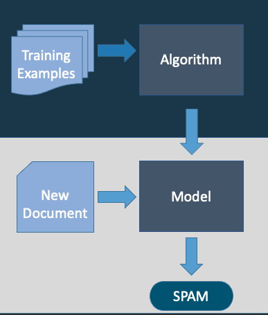
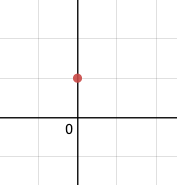

# Introduction to Machine Learning: Background and Pragmatics

---
# More Probability Review
- Sampling
Drawing randomly from a probability distribution is called **sampling** from it.  We do this according to the probabilities of various events.
    - Example: Rolling a die once is one sample (or "draw") $x$ from the distribution $\mathcal{D}$ of die rolls.
    We write this $x\sim \mathcal{D}$.
---
# More Probability Review
- Expectation or Expected Value:
    - Average result based on some probability distribution
- Suppose we have a fair, six-sided die, with sides labeled 1-6.
$$
\underset{x\sim D}{\mathbb{E}}[X]=\frac{1}{6}\times 1 + \frac{1}{6} \times 2 + \frac{1}{6} \times 3 + \frac{1}{6} \times 4 + \frac{1}{6} \times 5 + \frac{1}{6} \times 6
$$
$$
= \frac{1}{6} \left(1 + 2 + 3 + 4 + 5 + 6 \right) = 3.5.
$$


---
# More Probability Review
- Expectation or Expected Value:
    - Average result based on some probability distribution
- Suppose we have a fair, six-sided die, with sides labeled 1-6.
$$
\underset{x\sim D}{\mathbb{E}}[X]=\frac{1}{6}\times 1 + \frac{1}{6} \times 2 + \frac{1}{6} \times 3 + \frac{1}{6} \times 4 + \frac{1}{6} \times 5 + \frac{1}{6} \times 6
$$
$$
= \frac{1}{6} \left(1 + 2 + 3 + 4 + 5 + 6 \right) = 3.5.
$$
- Since this is a uniform distribution, we can move the probability outside of the parentheses.

---
# More Probability Review
- **Expectation** or Expected Value:
    - Average result based on some probability distribution
- Suppose we have an  unfair, six-sided die, with sides labeled 1-6, with $P(x=1)=\frac{1}{2}$ and $P(2 \leq x \leq 6) = \frac{1}{10}$

$$
= \frac{1}{2} \left( 1 \right) + \frac{1}{10} \left(2 + 3 + 4 + 5 + 6 \right) = 1.9
$$
- Since this is a uniform distribution, we can move the probability outside of the parentheses.

---
# Notation:  Indicator Function
The indicator function $\mathbb{1}_A[X]\rightarrow \{0,1\}$ returns 1 if the condition $X$ is true and 0 otherwise.
That is,

$$
  \mathbb{1}_A[x] :=
\begin{cases}
    1,& \text{if } x \text { satisfies } A\\
    0,              & \text{otherwise}
\end{cases}
$$

For example,
$$
  \mathbb{1}_{x\in \{1,2,3\}}[4]= 0.
$$

---
# Essential Linear Algebra Review
- A **vector** is a list of numbers.
$$\mathbf{w}=[1,2]$$
$$\mathbf{x}=[3,0]$$ 

---
# Essential Linear Algebra Review
- A **vector** is a list of numbers.
$$\mathbf{w}=[1,2]$$
$$\mathbf{x}=[3,0]$$ 
- Has geometric interpretations.


---
# Essential Linear Algebra Review
- A **vector** is a list of numbers.
$$\mathbf{w}=[1,2]$$
$$\mathbf{x}=[3,0]$$ 
- Has geometric interpretations.
- Consider **vector addition**.
$$\mathbf{w} + \mathbf{x} = [1+3, 2+0] = [4,2]$$


---
# Essential Linear Algebra Review
$$\mathbf{w}=[1,2]$$
$$\mathbf{x}=[3,0]$$ 

- The **magnitude** of $\mathbf{w}$ is $||\mathbf{w}||$.
- Distance formula/Pythagorean Theorem
    - $\ell^2$ norm, also written $||\mathbf{x}||_2$
$$\mathbf{||w}||=\sqrt{1^2+2^2}=\sqrt{5}\approx2.23$$


---
# Essential Linear Algebra Review
$$\mathbf{w}=[1,2]$$
$$\mathbf{x}=[3,0]$$ 

- The $\ell^1$ norm of $\mathbf{w}$ is $||\mathbf{w}||_1$.
- $||\mathbf{w}||_1 = |1| + |2| = 3$
    - Sum of the individual magnitudes of each component (dimension) in a vector.
    
$$\mathbf{||w}||=\sqrt{1^2+2^2}=\sqrt{5}\approx2.23$$


---
# Essential Linear Algebra Review
$$\mathbf{w}=[1,2]$$
$$\mathbf{x}=[3,0]$$ 

- The $\ell^1$ norm of $\mathbf{w}$ is $||\mathbf{w}||_1$.
- $||\mathbf{w}||_1 = |1| + |2| = 3$
    - Sum of the individual magnitudes of each component (dimension) in a vector.
    



---
# Essential Linear Algebra Review
$$\mathbf{w}=[1,2]$$
$$\mathbf{x}=[3,0]$$ 

- The $\ell^1$ norm of $\mathbf{w}$ is $||\mathbf{w}||_1$.
- $||\mathbf{w}||_1 = |1| + |2| = 3$
    - Sum of the individual magnitudes of each component (dimension) in a vector.
    - Manhattan/taxicab distance


---
# Essential Linear Algebra Review

$$\mathbf{w}=[1,2]$$
$$\mathbf{x}=[3,0]$$ 
- Dot product
$$\mathbf{w} \cdot \mathbf{x} = 3\times 1 + 2 \times 0 = 3$$
$$ = \mathbf{w}\mathbf{x}^T = 
\begin{bmatrix}
1, 2
\end{bmatrix}
\begin{bmatrix}
3 \\ 0
\end{bmatrix}
$$


---
# Essential Linear Algebra Review

$$\mathbf{w}=[1,2]$$
$$\mathbf{x}=[3,0]$$ 
- Dot product
$$\mathbf{w} \cdot \mathbf{x} = 3\times 1 + 2 \times 0 = 3$$
$$ = \mathbf{w}\mathbf{x}^T = 
\begin{bmatrix}
1, 2
\end{bmatrix}
\begin{bmatrix}
3 \\ 0
\end{bmatrix}
$$

---
# Essential Linear Algebra Review

$$\mathbf{w}=[1,2]$$
$$\mathbf{x}=[3,0]$$ 
- Dot product
$$\mathbf{w} \cdot \mathbf{x} = 3\times 1 + 2 \times 0 = 3$$
$$ = \mathbf{w}\mathbf{x}^T = 
\begin{bmatrix}
1, 2
\end{bmatrix}
\begin{bmatrix}
3 \\ 0
\end{bmatrix}
$$

---
# Essential Linear Algebra Review

$$\mathbf{w}=[1,2]$$
$$\mathbf{x}=[3,0]$$ 
- Dot product
$$\mathbf{w} \cdot \mathbf{x} = 3\times 1 + 2 \times 0 = 3$$
$$ = \mathbf{w}\mathbf{x}^T = 
\begin{bmatrix}
1, 2
\end{bmatrix}
\begin{bmatrix}
3 \\ 0
\end{bmatrix}
$$
$$
= \|\mathbf{w}\|\|\mathbf{x}\|\cos\theta,
$$

where $\theta$ is the angle between $\mathbf{w}$ and $\mathbf{x}$.
Thus,
$$
\cos\theta = \frac{\mathbf{w}\cdot \mathbf{x}}{\|\mathbf{w}\|\|\mathbf{x}\|}
$$


---
# Introduction to Machine Learning: Pragmatic Background
- Python
- NumPy
- Pandas
- Terminal

---
# Python
- Python is a **scripting language**.
    - No compilation
    - Most popular "glue" language for machine learning
    - Simple syntax
    - Slow

---
# Python for Machine Learning
- Most backend ML code written in C/C++.
    - Cython also an option.
- For numerical computationas, use NumPy library.

---
# Python for Machine Learning
- In this class, turn code runnable from the terminal on a lab computer (not Jupyter notebooks, unless otherwise specified).
- http://www.learnpython.org has explanation of basic Python syntax, as well as NumPy and Pandas.

---
# Basic NumPy
- NumPy is a Python interface for highly efficient C code that works on arrays (vectors and matrices).
```python
import numpy as np
my_list = [1, 2, 3]
x = np.array(my_list)
```

---
# Basic NumPy
- NumPy is a Python interface for highly efficient C code that works on arrays (vectors and matrices).
```python
import numpy as np
my_list = [1, 2, 3]
x = np.array(my_list)
print(x/3)
```
Output
```bash
[1.         1.33333333 1.66666667]
```

---
# Basic NumPy
- NumPy is a Python interface for highly efficient C code that works on arrays (vectors and matrices).
```python
import numpy as np
x = np.array([1,0,1])
y = np.array([3, 4, 5])
np.dot(x,y)
```
Output
```bash
8
```

---
# Basic NumPy
2D Array
```python
import numpy as np
b = np.array([(1, 2, 3), (4, 5, 6)])
print(b)
```
Output
```bash
[[1 2 3]
 [4 5 6]]
```
---
# Basic NumPy
```python
import numpy as np
X = np.zeros((4,4))
print(X)
```
Output
```bash
[[0. 0. 0. 0.]
 [0. 0. 0. 0.]
 [0. 0. 0. 0.]
 [0. 0. 0. 0.]]
```

---
# Basic NumPy
```python
import numpy as np
X = np.zeros((4,4))
Y = np.ones((4,4))
print(X + Y)
```
Output
```bash
[[1. 1. 1. 1.]
 [1. 1. 1. 1.]
 [1. 1. 1. 1.]
 [1. 1. 1. 1.]]
 ```

---
# Basic NumPy
```python
import numpy as np
X = np.array([1,2,3,4,5,6,7])
X = np.reshape(3,2)
print(X)
```
Output
```python
[[1 2]
 [3 4]
 [5 6]]
 ```


 ---
# Basic NumPy
```python
import numpy as np
X = np.array([1,2,3,4,5,6,7])
X = np.reshape(3,2)
print(X)
print(X.T)
```
Output
```python
[[1 2]
 [3 4]
 [5 6]]

 [[1 3 5]
 [2 4 6]]
 ```
 
  ---
# Basic NumPy
$$
XX^T
$$
```python
import numpy as np
X = np.array([1,2,3,4,5,6,7])
X = np.reshape(3,2)
print(np.matmul(X, X.T))
# matrix multiplication
```
Output
```python
[[ 5 11 17]
 [11 25 39]
 [17 39 61]]
 ```
---
# Basic NumPy
- If you find yourself writing for-loops over lists of numbers, you should probably be using NumPy instead.
- See the [NumPy Tutorial](https://numpy.org/doc/stable/user/quickstart.html) and documentation for more examples.

---
# Basic Pandas
- Much data is in CSV (column-separated value) format. 
- Top line is **header**
```csv
name,age,weight
zakk,18,145
tym,19,150
alyssa,45,134
```

| name   | age | weight |
| ------ |:--- | ------ |
| zakk   | 18  | 145    |
| tym    | 19  | 150    |
| alyssa | 45  | 134    |

---
# Basic Pandas
- Pandas is a library for handling this kind of column data.
- Appropriate when data will fit in RAM.
    - Not strictly necessary, but popular and useful.
    - Alternative, Python `csv` package or equivalents.

---
# Basic Pandas
- Key data structure is `DataFrame`.
- Can load and write CSVs with one function call and query columns directly.
- See [10 Minutes to Pandas](https://pandas.pydata.org/docs/user_guide/10min.html) for more examples.

---
# Scikit-Learn Basics
- Provides a consistent framework for running experiments.
- Holds data in NumPy arrays.
- You will not use this when implementing core algorithms for assignments.  (This would defeat the purpose of the assignment.
- API has several parts:
- **Estimators** estiamte parameters a in dataset using `fit()` -- for example `imputer`.
- **Transformers** (not to be confused with the deep learning ones) are estimator change the dataset with `fit_transform()`.
- **Predictors** make predictions on a dataset with `predict()` and `score()` the predictions on a test set.    

---
# Working on the Command Line
- You must become comfortable with using Unix-like terminals.
- Basic commands: `ls`, `pwd`, `cd`, `Ctrl+C`, `Ctrl+D`, `cat`, `less`.
- Should have basic knoweldge of a termninal-based text editor.
    - e.g., `emacs`, `vi`, `vim`
    - This will help you if you work remotely.
- Should be comfortable with I/O redirection and piping.

---
# Machine Learning Pragmatics
- Machine learning models use **features** to learn and make predictions.
    - Also called **attributes** or **independent variables** in other fields.
- In a spam vs. ham classificaton task, the features might be the *words*, or some subset thereof.
 - We split our data into a **training data**, **development data**, and **test data**.
 - We don't look at the training data.  We train on the training data try to *learn* a model that generalizes will to unseen (test data).

 ---
 # Machine Learning Basics
 - We represent our features in a **feature vector**, usually denoted $\mathbf{x}$.
 - Features can be **numerical** (e.g., prices) or **categorial** (e.g., words).
 - Every position in the feature vector represents a single feature.
 - In supervised learning, what we're trying to predict can also be either numerical or categorical.
 

 ---
 # Categorical Varibles

  - Every position in the feature vector represents a single feature.
 Suppose we have features for two words in an e-mail: *promise* and *thank*, and the following ham e-mail:

>I've been searching for the right words to thank you for this breather.
 i wont take your help for granted and will fulfil my obligation. 
 You have been wonderful and a blessing at all times.

| promise  | thank |
| -------- | ------|
| 0        |      1|

---
 # Categorical Variables
- Binary **feature values**
    - Words are the **features**, and 1 and 0 are **feature values**.
    - Called **one-hot-encoding** or one-hot vector.  One elemement in the vector is "hot" (1) if the corresponding feature is present and 0 otherwise.


| promise  | thank |
| -------- | ------|
| 0        |      1|

**Feature vector**: $\mathbf{x}=[0,1]$

---
 # Categorical Varibles


| promise  | thank |
| -------- | ------|
| 0        |      1|

$$\mathbf{x}=[0,1]$$
- This **feature vector** exists in a gemetric space.

- Can interpret as points or as directional vectors.
- Usually we have many (maybe even hundreds or thousands or more) dimensions.

---
 # Categorical Varialbes
If we have slightly more features, our training data might look like this, where our classes $y\in\{1, 0\}$, and SPAM is $y = 1$ and HAM is $y = 0$.

| y | $x_1$ | $x_2$ | $x_3$ | $x_4$ | $x_5$ |
|-------| ------| ------|-------|-------|-------|
| 1     |   1   |   1   |   1   |   1   |   1   |
| 0     |   1   |   0   |   0   |   0   |   1   |
| 1     |   1   |   0   |   1   |   1   |   1   |
| 0     |   0   |   1   |   0   |   0   |   1   |

- This is a **sparse matrix**, i.e., it has a lot of 0's.


---
# The Idea of Learning
While the ML algorithm is **learning**, it is attempting to reduce the **error** or **loss** on its training examples.
    - This is a measure of how wrong the guess is.
- Given a training example $x$ with a correct class $y\in \mathcal{Y}$, the model generates a **hypothesis** based on the feature vector, $h(x)$ from the set of possible hypotheses $\mathcal{H}$
- Algorithm tries to learn a **concept** $c:X\rightarrow Y$.
    - More on this later.

---
# The Idea of Learning
- We need a way to measure our error -- how wrong the model is when it guesses.
    - There are many ways of measuring this.
    - One important example: Mean Squared Error
$$
MSE = \frac{1}{2n}[y_i - h(x_i)]^2,
$$
where $n$ is the number or examples,  $y_i$ is the true answer, and $h(x_i)$ is the model's guess (hypothesis).
- If the hypothesis matches the true answer exactly, $MSE=0$.
- Sometimes, $h(x)$ is written as $\hat{y}$, the estimate of $y$.
$$
MSE = \frac{1}{2n}[Y - \hat{Y}]^2.
$$

