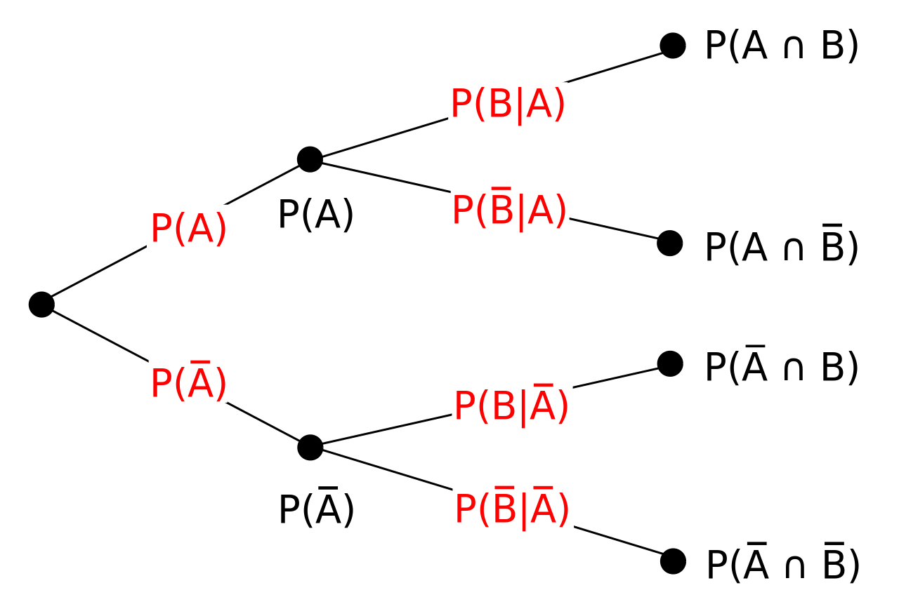

# Bayes's Rule
- Discovered by Thomas Bayes in 1700s, published in 1763
- Important in statistics, computer science, physics, philosophy, and many other fields.

---
# Bayes's Rule
- Discovered by Thomas Bayes in 1700s, published in 1763
- Important in statistics, computer science, physics, philosophy, and many other fields.

---
# Bayes's Rule

Given some statistical data, how do we estimate $P(A)$?

---
# Bayes's Rule

Given some statistical data, how do we estimate $P(A)$?
 - Count and divide
 $$
  \frac{\text{count}(A)}{\text{count}(\text{all outcomes})}
 $$
 

 ---
# Bayes's Rule

Given some statistical data, how do we estimate $P(A)$?
 - Count and divide:
 $$
  \frac{\text{count}(A)}{\text{count}(\text{all outcomes})}.
 $$
-  For example, $P(\text{``computer"})$ in some collection of text, would be 
$$
    \frac{\text{count}(\text{``computer"})}{\text{count}(\text{all words})}.
$$

 ---
# Bayes's Rule

Given some statistical data, how do we estimate $P(A)$?
 - Count and divide:
 $$
  \frac{\text{count}(A)}{\text{count}(\text{all outcomes})}.
 $$
-  For example, $P(\text{``computer"})$ in some collection of text, would be 
$$
    \frac{\text{count}(\text{``computer"})}{\text{count}(\text{all words})}.
$$
- If $\mathcal{D}$ is the  distribution of words in a text corpus and we randomly sample a word $x\sim\mathcal{D}$, this is $\hat{P}(x=\text{``computer''})$.

---
# Bayes's Rule
Consider this SPAM/HAM data from last time.

| y | $x_1$ | $x_2$ | $x_3$ | $x_4$ | $x_5$ |
|-------| ------| ------|-------|-------|-------|
| 1     |   1   |   1   |   1   |   1   |   1   |
| 0     |   1   |   0   |   0   |   0   |   1   |
| 1     |   1   |   0   |   1   |   1   |   1   |
| 0     |   0   |   1   |   0   |   0   |   1   |

What are $P(y = 1)$ and $P(y = 0)$?

---
---
# Bayes's Rule
Suppose we have two events, $A, B$, where $P(B) \neq 0$.
- How do we estimate $P(A|B)$?
    - Probability we get $A$ if we take $B$ for granted.
    - Probability $B$ *generates* $A$

# Bayes's Rule
Suppose we have two events, $A, B$, where $P(B) \neq 0$.
- How do we estimate $P(A|B)$?
The definition of conditional probability is
$$
P(A|B)=\frac{P(A\cap B)}{P(B)}.
$$

---
# Bayes's Rule
Suppose we have two events, $A, B$, where $P(B) \neq 0$.
- How do we estimate $P(A|B)$?
The definition of conditional probability is
$$
P(A|B)=\frac{P(A\cap B)}{P(B)}.
$$
- Interpretation: proportion of $B$'s probability space in which $A$ **also** occurs.
    - I.e., If we know $B$, how likely is $A$?

---

---
# Bayes's Rule
What if we want to calculate $P(A|B)$ but only have access to $P(B|A)$?

---
# Bayes's Rule
What if we want to calculate $P(A|B)$ but only have access to $P(B|A)$?
Bayes's Rule states:
$$
P(A\vert B) = \frac{P(B\vert A)P(A)}{P(B)}.
$$
- $P(A)$ is called the **prior**.

---
# Bayes's Rule
What if we want to calculate $P(A|B)$ but only have access to $P(B|A)$?
Bayes's Rule states:
$$
P(A\vert B) = \frac{P(B\vert A)\overbrace{P(A)}^\text{prior}}{P(B)}.
$$
- $P(A)$ is called the **prior**.

---
# Bayes's Rule
What if we want to calculate $P(A|B)$ but only have access to $P(B|A)$?
Bayes's Rule states:
$$
P(A\vert B) = \frac{P(B\vert A)\overbrace{P(A)}^\text{prior}}{P(B)}.
$$

- $P(A)$ is called the **prior**.
    - Before we know anything else, what is our estimate of $P(A)$?
        - Simple way to estimate: count and divide in a dataset.

---
# Bayes's Rule
What if we want to calculate $P(A|B)$ but only have access to $P(B|A)$?
Bayes's Rule states:
$$
P(A\vert B) = \frac{\overbrace{P(B\vert A)}^\text{likelihood}P(A)}{P(B)}.
$$
- $P(B|A)$ is called the **likelihood**.
    - If we know $A$ has occurred, how likely is $B$ to occur then?

---
# Bayes's Rule
What if we want to calculate $P(A|B)$ but only have access to $P(B|A)$?
Bayes's Rule states:
$$
P(A\vert B) = \frac{\overbrace{P(B\vert A)P(A)}}{P(B)}.
$$
- Together, the **prior** and **likelihood** tell us:
    - The proportion of the probability space when $A$ occurs.
        - The proportion of *that* space in which $B$ occurs.

 ---
# Bayes's Rule
$$
P(A\vert B) = \frac{P(B\vert A)P(A)}{\underbrace{P(B)}}.
$$

- $P(B)$ is the **normalizing constant** and the **marginal likelihood**.  It makes our probabilities all sum to 1.
- We are calculating the proportion of $B$'s probability space (in the denominator) in which the numerator occurs.
    - The denominator tells us that we are **assuming** $B$ has already occurred.
    - If $P(B)$ is *small*  (say, $\frac{1}{10}$), $P(A|B)$ will be scaled larger. (Why?)

---
# Bayes's Rule
$$
P(A\vert B) = \frac{P(B\vert A)P(A)}{\underbrace{P(B)}}.
$$

- $P(B)$ is the **normalizing constant** and the **marginal likelihood**.  It makes our probabilities all sum to 1.
- We are calculating the proportion of $B$'s probability space (in the denominator) in which the numerator occurs.
    - The denominator tells us that we are **assuming** $B$ has already occurred.
    - If $P(B)$ is *small*  (say, $\frac{1}{10}$), $P(A|B)$ will be scaled larger. (Why?)
    - The greater the difference between the numerator and denominator, the more "informative" $A$ is in our prediction of $B$.

---
# Bayes's Rule
$$
\underbrace{P(A\vert B)}_\text{posterior} = \frac{P(B\vert A)P(A)}{P(B)}
$$

Bayes's formula is used to calculate the **posterior** probablity, $P(A|B).

---
# Bayes's Rule
Suppose $A$ and $B$ are two mutually exclusive events.  Then,
$$
P(A\vert B) = \frac{P(B\vert A)P(A)}{P(B)}
$$

$$
= \frac{P(B\vert A)P(A)}{P(B\vert A) + P(B\vert \lnot A)}
$$

$$
= \frac{P(B\vert A)P(B)}{P(B\vert A)P(A) + P(B\vert \lnot A)P(\lnot A)},
$$

or
$$
 \frac{P(A;A\rightarrow B)}{P(\text{B under any circumstances})}.
$$

---
# Bayes's Rule
Suppose $A$ and $B$ are two mutually exclusive events.  Then
$$
P(A\vert B) = \frac{P(B\vert A)P(A)}{P(B)},
$$

or

$$
 \frac{P(A;A\rightarrow B)}{P(\text{B under any circumstances})}.
$$

In general, for any number of events:
$$
P(A_i| B) = \frac{P(B| A_i) P(A_i)}{\sum\limits_j P(B| A_j) P(A_j)}
$$
- Denominator is marginalizing out the $A$'s to give us $P(B)$.
---
# Bayes's Rule

Suppose we have only two possibilities.  Then
$$
P(A\vert B) = \frac{P(B\vert A)P(A)}{P(A)}
$$

- Practical detail: if we're just ranking the probabilities, we don't need the denominator, since  $P(A|B) \propto P(B|A)P(A)$.

-  In computer science, we usually take the log, to avoid underflow from multiplying small numbers.  So, we use **log probabilities**: $\log P(x)$.
- in this case $\log [P(B|A)P(A)] = \log P(B|A) + \log P(A)$.
