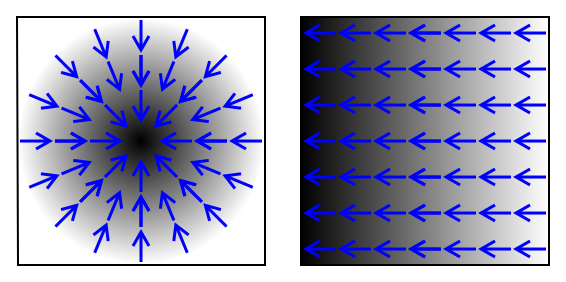

# Prediction and Logistic Regression
2022-2-2

---
# Prediction

- Fundamental in modern machine learning approaches to computational linguistics

- Recall that we use our **training data** to set parameters in a model (train the model) and test on **test data**
- Given some data, e.g., a sentence, we want to predict something about it.

- For example, SPAM vs NOT SPAM or whether a product review is positive or negative

---
# Prediction

- Assume we have a corpus of reviews in which each review is labeled **classes** of positive (P) or negative (N) sentiment.

- Binary classification problem (2 classes/labels)

- We want to guess P or N (the classes) based only on the review text

- We need a set of **features** from the review text to make this prediction

- We **train** a model to predict a class label on its own.

---
# Splitting the Data

- Suppose we have 1,000 labeled reviews

- We can Wet aside ~10% as our **development set** and ~10% as our **test set**.

- We use the remaining 80% as our **training set** to train the model

- Researchers shouldn't look at test data (and preferably training data) if possible

- Sets should usually be randomized to prevent biased model

- Training data ideally balanced by classes, but not always possible

---

# Splitting Data

- Alternative called **k-fold cross-validation**.
    - Run several training and testing sessions over random splits of the data
- Related: leave one out (LOO) evaluation, where you train on all but one test example over the hole dataset
    - Useful when data are small

---
# Training
- Process of making iterative changes to model's *parameters* to increase its performance

- One common measure of performance is **accuracy.**
$$
\text{accuracy} = \frac{\text{correct predictions}}{\text{all predictions}}.
$$

---
# Training
- In **supervised learning** we used these labeled examples to train our model.

- The correct labels are called **gold standard** labels.

- By looking at these labels, we want to **fit** the model to the data, making predictions on *unseen* test data

---
# Review: The Perceptron
- We know that $y=mx+b$ represents a line in  $\mathbb{R}^2$ 
- The $m$ represents the slope of the line, while $b$ is the $y$-intercept -- how much the line is shifted up or down.  We'll use $w$ instead of $m$.

-  In linear algebra and statistics parlance, the $w$ coefficient is known as a **weight**.  

---
# The Perceptron

We can use more terms

$$
y=w_1x_1+w_2x_2+b
$$

- The **weights** tell us how much influence a given term will have.

- Every $x$ has a corresponding $y$
---

# The Perceptron

We can have as weights and variables as we like, allowing us to generalize
$$
\begin{align} 
a = h_\mathbf{w}(\mathbf{x}) &= \mathbf{w}\cdot \mathbf{x} + b
 \\
&= w_1x_1+w_2x_2+\cdots+ w_nx_n + b \\
 &= \sum_{i=1}^n w_i x_i + b \\
 
\end{align}
$$

- Equation represents $n-1$ dimensional hyperplane in $\mathbb{R}^n$ to separate data
* Each weight $w_1$ coresponds to a **feature** $x_i$.
* Number of features = number of dimensions
---

<p align="right">

<!-- Image source: wikipedia. https://en.wikipedia.org/wiki/Perceptron-->

---
# The Perceptron
Prediction algorithm
```python
function predict(x)
    return sign(dot(w,x) + b)
```
$$
\text{predicted class} = sign(\mathbf{w}\cdot \mathbf{x} + b)
$$
---
# Perceptron Learning Algorithm
```python
1.  Initialize weights vector w to random numbers in [0, 1].
2.  for each example (x, y) in D:
        prediction = predict(x)
        if not sign(y) == sign(prediction):
            for each w in weights:
                w = w + y * x
                b = b + y * x
```
* Error-based learning
* If algorithm predicts wrong class, update weights
---
# Perceptron Learning Algorithm
```python
1.  Initialize weights vector w to random numbers in [0, 1].
2.  for each example (x, y) in D:
        prediction = predict(x)
        if not sign(y) == sign(prediction):
            for each w in weights:
                w = w + y * x
            b = b + y * x
```
## Update Rule for Weights
$$
w_i := w_i + \eta yx_i.
$$

---
# Perceptron Loss Function
$$
\begin{align}
\mathscr{L}(h_\mathbf{w}(\mathbf{x}),y) = 
\mathscr{L}(p,y) &= 
\begin{cases}
y-p & \text{if }  yp < 0 \\
0 & \text{otherwise} 
\end{cases}\\
  &= \text{max}(0, 1-yp)
  \end{align}
$$
* Hinge loss

<p align="center">

<!-- Image source: wikipedia. https://en.wikipedia.org/wiki/Hinge_loss-->
<p align="center">
<sub>Plot: hinge vs. 0-1 loss</sub>

---
# Logistic Regression

---
# Logistic Regression
* Like perceptron, but better
* Perceptron tends to **overfit** training data
    * Activation $a$ result of pure linear combination
    * In principle, unbounded

---
# Logistic Regression
* Using an **activation funtion** bounds the output.
For example, the binary step activation function:
* Send $a=\mathbf{w}\cdot\mathbf{x} + b$ through $f(t$).
$$
f(t)=
\begin{cases}
1 & \text{if }  t > 0\\
0 & \text{otherwise}
f\end{cases}
$$
<p>

<!-- Image source: wikipedia. https://en.wikipedia.org/wiki/Activation_function-->

---
# Logistic Regression
* Binary step function forfeits all information about confidence in prediction
* We can use a smooth version, a **sigmoid** (S-shaped) function called the **logistic function**.
$$
\sigma(t) = \frac{e^t}{1 + e^t} =\frac{1}{1+e^{-t}}.
$$
<p>

<!-- Image source: wikipedia. https://en.wikipedia.org/wiki/Activation_function-->

---

* This function gives ua a **probability** of the positive class.
$$
\begin{align}
p &= \sigma(\mathbf{w}\cdot\mathbf{x}+b) \\
&= \frac{1}{1+\text{exp}[-(\mathbf{w}\cdot\mathbf{x}+b)]}\\
&= \frac{1}{1+\text{exp}[-(\sum_{i=1}^n w_i x_i + b)]}\\
&= P(y=1|\mathbf{w};\mathbf{x})
\end{align}
$$
<p align="center">

<!-- Image source: wikipedia. https://en.wikipedia.org/wiki/Activation_function-->

---
# Logistic Regression Prediction Algorithm
* Our prediction and algorithms are slightly changed from those for the Perceptron.
* Classes are now 0 or 1 instead of -1 or 1
```python
function classify(x):
    p = predict(x)
    if p < 0.5:
        return 0
    else:
        return 1
        
function predict(x):
    return logistic(dot(w, x) + b))   
```

---
# Logistic Regression

* Note: we use **log probabilities** instead of pure probabilities
* Prevents underflow
    * Monotonicity maintained.
    $$log(ab) = log(a) + log(b)$$
    So,
    $$\log[p(x)p(y)] = \log p(x) + \log p(y)$$

    
---
# Logistic Regression Learning Algorithm
* (Very slightly) different update rule, but same principle
$$
w_i := w_i + \eta(y-p)x_i.
$$
```python
function train(x, y, learning_rate):
1.  Initialize weights vector w to 0 in [0, 1].
2.  for each example (x, y) in D:
        p = predict(x)
        for each w in weights:
            w = w + learning_rate * (y - p) * x
        b = b + learning_rate * (y - p) * x
```
* In perceptron, update is entirely determined by learning rate $\eta$.
* In logistic regression, update is determined by learning rate $\eta$ *and how wrong you were*, $y-p$

---
# Logistic Regression Loss Function
* Various names: logistic loss, cross-entropy loss, negative log likelihood
* Entropy is a term from information theory that we'll discuss later
    * Measurement of information content
* Logistic regreission is a **discriminative classifier**
    * Doesn't have a prior, unlike a generative classifier
    * Directly optimizes $P(y\vert x)$ over training data

---
 # Logistic Regression Loss Function
* Learns weights that predict
$$
\underset{y}{\text{argmax}}\text{ }P(y|\textbf{x};\textbf{w})
$$
* I.e., maximize the probability that it chooses the correct class, $y$.
* Only two possible classes, 1 or 0, so $P(y) = 1-P(\lnot y)$
---
# Logistic Regression Loss Function
* The **odds** or **likelihood** that an event $e$ occurs is the probability that it will occur divided by the probability that it won't
$$
\frac{P(y=1)}{1-P(y=1)} = \frac{P(y = 1)}{P(y = 0)}
$$
* Monotonic transformation of probabilities
* Maps probabilities from $[0,1]$ to $[-\infty,\infty]$
    * Reverse of what logistic function does
* Ex: if $P(y=1) = .75$, then $P(y=0) = .25$. 
    * Odds of class 1 is .75/.25, or 3 to 1.

---
# Logistic Regression Loss Function
* Assume $P(y=1)=p=\sigma(\mathbf{w}\cdot\mathbf{x}+b)$
    Then, 
    $$
    \begin{align}
    P(y=0)&=1-p\\
    &=1-\sigma(\mathbf{w}\cdot\mathbf{x}+b)\end{align}
    $$
 *  Or, more compactly,
    $$
    p^y(1-p)^{1-y}=\sigma(\mathbf{w}\cdot\mathbf{x}+b)^y(1-\sigma(\mathbf{w}\cdot\mathbf{x}+b))^{1-y}.
    $$
  * Taking the log, we have:
    $$
    y\log p + (1-y)\log(1-p)
    $$
    $$
    = y\log\sigma(\mathbf{w}\cdot\mathbf{x}+b) + (1-y)(1- \log\sigma(\mathbf{w}\cdot\mathbf{x}+b)),
    $$
    which is the **log likelihood** of a correct answer.

---
# Logistic Regression Loss Function

* Our loss function is log likelihood defined over all of our training data.
    * So, we sum over the individual examples' losses in all of our training data for our loss function
$$
\begin{align}
\mathscr{L}(\mathbf{x})=&\sum_{(\mathbf{x},y)\in D} [y\log p + (1-y)\log(1-p)]\\
=& \sum_{(\mathbf{x},y)\in D} [y\log\sigma(\mathbf{w}\cdot\mathbf{x}) + (1-y)(1- \log\sigma(\mathbf{w}\cdot\mathbf{x}+b))],
\end{align}
$$

---


# Logistic Regression Loss Function

 - Also called **cross-entropy loss**.
 - Cross-entropy between true probability distribution given by $y$ and the model's estimate, $p$.

- Recall, that **cross-entropy** is defined as 
$$
H(p,q) = -\sum_{x\in X} p(x) \log q(x).
$$
Given $m$ training examples, 
$$
\begin{align}
\mathscr{L(x)}&=\frac{1}{m}\sum_{i=1}^m H(p_i,q_i) 
\\&=-\frac{1}{m}\sum_{i=1}^m
[y\log p + (1-y)\log(1-p)]\
\end{align}
$$

---

# Relationship to log odds
$$
\begin{align}
\text{Assume }\ln\frac{p}{1-p}&=\mathbf{w}\cdot\mathbf{x}+b.\\
 \frac{p}{1-p} &= e^{\mathbf{w}\cdot\mathbf{x}+b} \\
 p &= (1-p)e^{\mathbf{w}\cdot\mathbf{x}+b} \\
 p &= e^{\mathbf{w}\cdot\mathbf{x}+b} -
pe^{\mathbf{w}\cdot\mathbf{x}+b}\\
 p + pe^{\mathbf{w}\cdot\mathbf{x}+b} &= e^{\mathbf{w}\cdot\mathbf{x}+b} \\
p(1+e^{\mathbf{w}\cdot\mathbf{x}+b}) &= e^{\mathbf{w}\cdot\mathbf{x}+b}\\
 p&=\frac{e^{\mathbf{w}\cdot\mathbf{x}+b}}{1+e^{\mathbf{w}\cdot\mathbf{x}+b}}\\ 
p&= \frac{1}{1+e^{-(\mathbf{w}\cdot\mathbf{x}+b)}}

 \end{align}
 $$

 ---
 # Optimization
## Review: Derivatives
* Rate of change or slope of a function
* Given a line, $y=mx+b$,
if $m=\frac{\Delta y}{\Delta x}=3/4$, this is the slope.
* Since lines have the same slpoe everywhere, we need only find it once
* For curves, the derivative function gives us the slope.
* Simple rule: If $f(x)=x^2$, then $\frac{dy}{dx}=f'(x)=2x$ at an arbitrary point

---
 # Optimization
## Partial Derivatives


* Given functions of more than one variable, rate of change along one dimension, assuming other ones held constant
    * For $f(x, y)$, when differentiating along $x$ axis, treat *y* as a constant
    * Written as $\frac{\partial f}{\partial{x}}$, $\frac{\partial f}{\partial{y}}$, etc.
<p>    

<!-- Image source: wikipedia. https://en.wikipedia.org/wiki/Gradient -->

---
# Optimization
## The Gradient
- The **gradient** is a vector of partial derivatives
    * One for each dimension
- Given a function of $n$ variables, the gradient has an partial derivative for very variable.
- Given a function $f(x, y, z)$, the graident of $f$ is
$$
\nabla f = 
\begin{bmatrix}
\frac{\partial f}{\partial x}, \frac{\partial f}{\partial y}, \frac{\partial f}{\partial z}
\end{bmatrix}.
$$
<p>    

<!-- Image source: wikipedia. https://en.wikipedia.org/wiki/Gradient -->


---
# Optimization
## The Gradient
* Gradient describes a **direction** within an $n$-dimensional space
    * Each element just a number (a slope along one dimension)
    * Key: direction of steepest ascent along the surface of $f$
<p align="right">

<!-- Image source: wikipedia. https://en.wikipedia.org/wiki/Gradient -->


---
# Optimization
## The Gradient
* Intuition: 
    * What is the maximum rate at which one can walk up a line?
    * What is the maximum rate at which one can walk up a hill at a given point?
        * What about along a single dimension?
<p>    

<!-- Image source: wikipedia. https://en.wikipedia.org/wiki/Gradient -->

---
# Optimization
* Intuition: 
    * What is the maximum rate at which one can walk up a line?
    * What is the maximum rate at which one can walk up a hill at a given point?
        * What about along a single dimension?
    * The magnitude gradient is just the aggregate of all of the slopes in every direction.
<p>    

<!-- Image source: wikipedia. https://en.wikipedia.org/wiki/Gradient -->


---
# Optimization
##### Intuition: Alternate View of the Gradient
$$
\begin{align}
\nabla f &= \frac{\partial f}{\partial x}\mathbf{i}+\frac{\partial f}{\partial y}\mathbf{j}+\frac{\partial f}{\partial z}\mathbf{k}\\
&= \frac{\partial f}{\partial x}
\begin{bmatrix}           
1\\0\\0
\end{bmatrix}
+\frac{\partial f}{\partial y}\begin{bmatrix}           
0\\1\\0
\end{bmatrix}+\frac{\partial f}{\partial z}
\begin{bmatrix}           
0\\0\\1
\end{bmatrix}\\
&= 
\begin{bmatrix}           
\frac{\partial f}{\partial x}\\0\\0
\end{bmatrix}
+
\begin{bmatrix}           
0\\\frac{\partial f}{\partial y}\\0
\end{bmatrix}+
\begin{bmatrix}           
0\\0\\\frac{\partial f}{\partial z}
\end{bmatrix}\\
&= \begin{bmatrix}
\frac{\partial f}{\partial x}\\
\frac{\partial f}{\partial y}\\
\frac{\partial f}{\partial x}
\end{bmatrix}
\end{align}
$$

---
# Optimization
## Gradient
* The magnitude of the gradient $|\nabla f|$ is the **Euclidean distance**,  **Euclidean norm** or $\ell^2$ norm
* Same distance formula we learned in high school or earlier
$$
|\nabla f(x,y)|= \sqrt{\left(\frac{\partial f}{\partial x}\right)^2+\left(\frac{\partial f}{\partial y}\right)^2}. 
$$
$$
|\nabla f(x,y,z)|= \sqrt{\left(\frac{\partial f}{\partial x}\right)^2+\left(\frac{\partial f}{\partial y}\right)^2+\left(\frac{\partial f}{\partial z}\right)^2},
$$

---
# Optimization
## Gradient Descent
* Goal:  Minimize loss/maximize log likelihood or correct answers
* Loss function is **convex**
* If we can walk down the loss function, we can minimize the error on the training data
    * This is what traning is
* Use the negative gradient $-|\nabla f|$ to minimize loss
    * Same as taking the negative partial derivative of every element in gradient vector

---
# Optimization
## Gradient Descent
* Recall our loss function is
$$
\begin{align}
\mathscr{L}(\mathbf{x})=-[y\log p + (1-y)\log(1-p)]\\=-[ y\log\sigma(\mathbf{w}\cdot\mathbf{x}) + (1-y)(1- \log\sigma(\mathbf{w}\cdot\mathbf{x}+b)]
\end{align}
$$
---
# Optimization
## Gradient Descent
* Recall our loss function is
$$
\begin{align}
\mathscr{L}(\mathbf{x})&=-[y\log p + (1-y)\log(1-p)]\\&=-[ y\log\sigma(\mathbf{w}\cdot\mathbf{x}) + (1-y)(1- \log\sigma(\mathbf{w}\cdot\mathbf{x}+b)]
\end{align}
$$
Its derivative is:
$$
\begin{align}
\mathscr{L}\prime(\mathbf{x})&=\sum_{(x,y)\in D}(y-p)x_i\\
&=\sum_{(\mathbf{x},y)\in D}(y-\sigma(\mathbf{w}\cdot\mathbf{x+b}))x_i
\end{align}
$$


---

# Optimization
## Gradient Descent
$$
\begin{align}
\mathscr{L}\prime(\mathbf{x})&=\sum_{(x,y)\in D}(y-p)x_i\\
&=\sum_{(\mathbf{x},y)\in D}(y-\sigma(\mathbf{w}\cdot\mathbf{x+b}))x_i
\end{align}
$$
* If we remove the summation, we have most of the update rule!
$$(y-p)x_i$$

---
# Optimization
## Gradient Descent

$$
\begin{align}
\mathscr{L}\prime(\mathbf{x})&=\sum_{(x,y)\in D}(y-p)x_i\\
&=\sum_{(\mathbf{x},y)\in D}(y-\sigma(\mathbf{w}\cdot\mathbf{x+b}))x_i
\end{align}
$$
* If we remove the summation, we have most of the update rule!
$$(y-p)x_i$$
* Just add the learning rate:
$$
\begin{align}
w_i &:= w_i +\eta(y-p)x_i\\
w_i &:= w_i + \eta \nabla \mathscr{L}
\end{align}
$$

---
# Optimization
## Gradient Descent
$$
\begin{align}
w_i &:= w_i +\eta(y-p)x_i\\
w_i &:= w_i + \eta \nabla \mathscr{L}
\end{align}
$$

* The loss function's derivative is our update rule, changes weight $w_i$ by the gradient given by the example!
* The learning rate $\eta$ is a **hyperparameter** that determines how big of a step we take in the direction of given by the gradient

---
# Optimization
## Gradient Descent
<p> 


<!-- Image source: wikipedia. https://en.wikipedia.org/wiki/Gradient_descent -->

---
# Optimization
## Gradient Descent
<p>    

<!-- Image source: wikipedia. https://en.wikipedia.org/wiki/Gradient_descent -->

---
# Optimization
## Stochastic Gradient Descent
* Full gradient descent requires going over all training data for one update
* Instead, we use **stochastic** gradient descent (SGD), which uses a single example from training data to update all parameters on one iteration
* Understanding logistic regression and SGD is crucial for understanding more complex algorithms