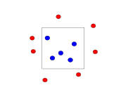

# Introduction to Statistical Learning Theory
2022-2-9

- These slides are based mostly on Ch. 2 of [Understanding Machine Learning](https://www.cs.huji.ac.il/w~shais/UnderstandingMachineLearning/index.html) by Shalev-Schwartz and Ben-David.

---
# Statistical Learning
## Notation:
$\mathcal{D}$ is a distribution over some set.

$\mathcal{D}^m$ is a probability over $Z^m$, a set of $m$ examples, induced by sampling $(z_1\ldots z_m)$, where each $z_i$ is sampled indepenently.

---
# Statistical Learning
## Formal Model:
- Learner's input:
    - domain set,  $\mathcal{X}$.  Usually, $x\in\mathcal{X}$ is a feature vector.
    - label set, $\mathcal{Y}$, usually $\{0,1\}$ or $\{-1,1\}$
    - training data $S = ((x_1, y_1),\ldots,(x_m, y_m)) \in \mathcal{X\times Y}$.

---
# Statistical Learning
## Formal Model
- Learner's input:
    - domain set,  $\mathcal{X}$.  Usually, $x\in\mathcal{X}$ is a feature vector.
    - label set, $\mathcal{Y}$, usually $\{0,1\}$ or $\{-1,1\}$
    - training data $S = ((x_1, y_1),\ldots,(x_m, y_m)) \in \mathcal{X\times Y}$.

-  Learner's output:
    - prediction rule $h: \mathcal{X}\rightarrow\mathcal{Y}$, called a hypothesis, predictor, or classifier.
    - data generation model

---

# Statistical Learning
## Formal Model
### Data Generation Model
- Assume training instances are generated by a distribution $\mathcal{D}$ over $\mathcal{X}$.
- The **generalization (true) error** of  of a classifier is the probability it does not predict the correct label of a random instance/data point generated by $\mathcal{D}$.  The error of prediction rule $h$ w.r.t. $\mathcal{D}$ and correct labeling function $f$ is defined as:
$$
L_{(D,f)}(h) \triangleq \underset{x\sim D}{\mathbb{P}}[h(x)\neq f(x)] \triangleq \mathcal{D}(\{x:h(x)\neq f(x)\})
$$
- Not that learner doesn't have access to $\mathcal{D}$ or $f$; it tries to approximate it with $S$.

---
# Empirical Risk Minimization
- Goal of algorithm is to find $h_S:\mathcal{X}\rightarrow\mathcal{Y}$ that minimizes generalization error w.r.t. $\mathcal{D}$ and $f$.
- Learner only has access to **empirical (training) error**, also known as  (**empirical risk**) based on training sample $S$.
$$
    L_S(h)\triangleq \frac{|\{i\in[m: h(x_i)\neq y_i]\}|}{m}
$$
where $[m] = [1, \ldots, m]$.
    - This is the average number of incorrectly labeled examples on the training set.
- Finding $h$ to minimize $L_S$ is **Empirical Risk Minimization (ERM)**.

---
# ERM Pitfall: Overfitting
- Extreme example: Assume data generated from uniform $D$. We can create a hypothesis $h_S$ that just memorizes $S$.  
    - In this case, we've minimized $L_S(h)$ but our true risk $L_D(h_S)=\frac{1}{2}$ (random.)
- Overfitting occurs when we fit our training data too well and it does not generalize.
---
# Hypothesis Classes
A **hypothesis** class $h\in \mathcal{H}$ is a restricted set of possible hypotheses.
- For example, axis-aligned rectangles.

---
# ERM Pitfall: Overfitting
- Extreme example: Assume data generated from uniform $D$. We can create a hypothesis $h_S$ that just memorizes $S$.  
    - In this case, we've minimized $L_S(h)$ but our true risk $L_D(h_S)=\frac{1}{2}$ (random.)
- Overfitting occurs when we fit our training data too well and it does not generalize.
- We can mitigate this by restricting hypothesis space.
    - Before seeing $S$, the learner chooses a set of predictors called a **hypothesis class**, $\mathcal{H}$
    - $\forall h\in \mathcal{H}: h \rightarrow \mathcal{X}\times\mathcal{Y}$.
    - $\text{ERM}_\mathcal{H}$ learner chooses predictor $h$ using sample $S$ with lowest empirical error:
    $$
    \text{ERM}_\mathcal{H}(S)\in \underset{h\in \mathcal{H}}{\text{argmin }}L_S(h).
    $$
---

# ERM Pitfall: Overfitting

 - $\text{ERM}_\mathcal{H}$ learner chooses predictor $h$ using sample $S$ with lowest empirical error:
 $$
    \text{ERM}_\mathcal{H}(S)\in \underset{h\in \mathcal{H}}{\text{argmin }}L_S(h).
 $$

 - Limiting hypothese to $H$ **biases** learner toward certain predictors.
    - Called **inductive bias**.
    - Decision of inductive bias (e.g., linear models, axis-aligned rectangles) may be based on certain aspects of the problem.
- Using more restricted hypothesis classes mitigates overfitting.

---
# Possible ERM Assumptions
## Realizability Assumption
$$
\exists h^*\in\mathcal{H}: L_{(\mathcal{D},f)}(h^*)=0
$$

With probability 1 over $S$, where $s\in S$ are sampled according to $\mathcal{D}$ and labeled by $f$, $L_S(h^*)=0$.

- Interpretation: for every hypothesis, our sample error is 0.

---
# Possible ERM Assumptions
## i.i.d. Assumption
- Training examples are independently and identically distributed according to $\mathcal{D}$.
    - Every $x_i\in S$ is sampled and labeled independently.
    - Written $S\sim\mathcal{D}^m$, where $m=|S|$ and $\mathcal{D}^m$ is the probability of over $m$-tuples of training instances, where each instance is selcted independently (i.i.d.) of the others.
    -  The larger the $m$, the better $S$ represents $\mathcal{D}$.

---
# Upper-bounding the Error

- Since $L_{(D,f)}(h_S)$ depends on a randomly sampled $S$, there is randomness in $L_{(D,f)}(h_S)$.
- The probability of getting a non-representative sample $S$ is $\delta$.
    - The **confidence parameter** is $1-\delta$.
- We want an upper bound on the probability that our sample of $m$ instances  leads to $L_{(D,f)}(h_S)>\epsilon$. And $L_{(D,f)}(h_S)\leq\epsilon$ implies an **approximately correct** learner.
    - The **accuracy parameter** is $\epsilon$.
- Let $S|_x=(x_1,\ldots,x_m$) be the training data. 
- We want to upper bound $\mathcal{D}^m(\{S|_x\ : L_{(D,f)}(h_S)>\epsilon\})$
    - i.e., Bound probability that true error, when trained on $S|_x$, exceeds $\epsilon$
    
---
# Upper-bounding the Error

When $L_{(D,f)}(h_S)\leq\epsilon$, the model is an **approximately correct** predictor.

Let $\mathcal{H}_B$ be a set of bad hypotheses, i.e., prediction rules that lead to high error:
$$
\mathcal{H}_B=\{h\in\mathcal{H}: L_{(\mathcal{D},f)}(h) > \epsilon\} .
$$
Let $M=\{S|_x : \exists h \in \mathcal{H}_B, L_S(h) = 0\}= \bigcup\limits_{h\in \mathcal{H}_B} \{S|_x : L_S(h) = 0\}$ be the set of misleading samples (sets of examples), i.e., for every $S|_x\in M$, there's a bad hypothesis $h\in \mathcal{H}_B$ that seems good on $S|_x$.

Since the realizability assumption implies that $L_S(h_S)=0$, we can only have high true error $L_{(\mathcal{D},f)}(H_s)>\epsilon$ if $\exists h\in \mathcal{H}_B$ s.t. $L_S(h)=0.$
    

---
# Upper-bounding the Error
- We only get high true/generalization error if training sample is from set of misleading examples $M$ (low training error; high true error): $\{S|_x L_{(D,f)}(h_S)\}>\epsilon\subseteq M$.

Recall: $M = \bigcup\limits_{h\in \mathcal{H}_B} \{S|_x : L_S(h) = 0\}.$
- The union formulation of bad examples tells us that the set of bad samples $M$ (which cause high *true* risk) is the set of all samples such that the *empirical* risk of a bad hypothesis $h$ is $L_S(h)=0$.
- Recall union bound: $P(A\cup B) \leq P(A) + P(B)
$.
- So, the probability of high ($>\epsilon$)true error must be no greater than cumulative probability of each bad example giving 0 sample errors (by union bound):
$$
\mathcal{D}^m(\{S|_x : L_{(\mathcal{D},f)}(h_S\} > \epsilon) \leq \sum_{h\in\mathcal{H}_B} \mathcal{D}^m(\{S|_x : L_S(h) = 0\}).
$$

---
# Upper-bounding the Error
$$
\mathcal{D}^m(\{S|_x : L_{(\mathcal{D},f)}(h_S\} > \epsilon) \leq \sum_{h\in\mathcal{H}_B} \mathcal{D}^m(\{S|_x : L_S(h) = 0\}).
$$
- Now we want to bound the right-hand side of the inequality.  Fix $h\in \mathcal{H}_B$.
- Zero sample error is for a bad hypothesis $h_B$ equivalent to only correct predictions:
$$
\forall i, h(x_i) = f(x_i),
$$
where $f(x_i)$ is the correct prediction.
So,
 $$
\mathcal{D}^m(\{S_|x : L_S(h_B)=0\})=\mathcal{D}^m(\{S|_x : \forall i, h(x_i = f(x_i\})
$$
And Since training examples are sampled i.i.d,  we can multiply the probabilities.
$$
\mathcal{D}^m(\{S_|x : L_S(h_B)=0\})=\mathcal{D}^m(\{S|_x : \forall i, h(x_i) = f(x_i)\})=\prod_{i=1}^m\mathcal{D}(\{x_i : h(x_i)=f(x_i)\}).
$$

---
# Upper-bounding the Error

$$
\begin{align}
\mathcal{D}^m(\{S_|x : L_S(h_B)=0\})&=\mathcal{D}^m(\{S|_x : \forall i, h(x_i) = f(x_i)\})\\
&=\prod_{i=1}^m\mathcal{D}(\{x_i : h(x_i)=f(x_i)\}).
\end{align}
$$

- For every sampled training example, the probability that the bad hypothesis $h\in \mathcal{H}_B$ is correct is one minus the probability that it's wrong (the true risk):
$$
\mathcal{D}(\{x_i : h(x_i)=y_i\}) = 1 - L_{(\mathcal{D},f)}(h)
$$
Recall that $\mathcal{H}_B=\{h\in\mathcal{H}: L_{(\mathcal{D},f)}(h) > \epsilon\}$, so $L_{(D,f)}(h) > \epsilon$.
Thus,
$$
\mathcal{D}(\{x_i : h(x_i)=y_i\}) = 1 - L_{(\mathcal{D},f)}(h) \leq 1 - \epsilon.
$$

---
# Upper-bounding Error: Probably Approximately Correct
$$
\mathcal{D}(\{x_i : h(x_i)=y_i\}) = 1 - L_{(\mathcal{D},f)}(h) \leq 1 - \epsilon.
$$

Now, let $\mathcal{H}$ be a finite hypothesis class. Let $\delta\in (0,1)$ and $\epsilon > 0$.  Let $m$ be an integer that satisfies $m \geq \frac{\log(|\mathcal{H}|/\delta)}{\epsilon}.$

- Then for any labeling function $f$ and distribution $\mathcal{D}$ for which the realizability assumption holds ($\exists h\in \mathcal{H} : L_{(\mathcal{D}, f)})(h)=0$), with probability $\geq 1 - \delta$ over the choice of an i.i.d sample $S$ of size $m$, for every ERM hypothesis: $L_{(\mathcal{D},f)}(h_S) \leq \epsilon$
That is, for sufficiently large $m$, the $\text{ERM}_\mathcal{H}$ rule will be **probably** (confidence $1-\delta$) **approximately** (error $\leq \epsilon$) **correct** (PAC).
$$
    \mathbb{P}[L_{(\mathcal{D},f)}(h_S) \leq \epsilon] \geq 1-\delta.
$$