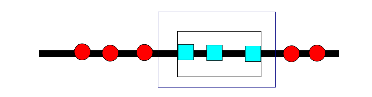

# PAC Learning
2022-2-9

- These slides use content based on Ch. 2 of [Foundations of Machine Learning](https://cs.nyu.edu/~mohri/mlbook/) and some content based on slides originally by Jordan-Boyd Graber.

---
# Statistical Learning
## Notation:
$\mathcal{D}$ is a distribution over some set.

$\mathcal{D}^m$ is a probability over $Z^m$, a set of $m$ examples, induced by sampling $(z_1\ldots z_m)$, where each $z_i$ is sampled indepenently.

---
# Statistical Learning
## Formal Model
- Learner's input:
    - domain set,  $\mathcal{X}$.  Usually, $x\in\mathcal{X}$ is a feature vector.
    - label set, $\mathcal{Y}$, usually $\{0,1\}$ or $\{-1,1\}$
    - training data $S = ((x_1, y_1),\ldots,(x_m, y_m)) \in \mathcal{X\times Y}$.

-  Learner's output:
    - prediction rule $h: \mathcal{X}\rightarrow\mathcal{Y}$, called a hypothesis, predictor, or classifier.
    - data generation model

---
# PAC Learning
* Recall:
For sufficiently large $m$, the $\text{ERM}_\mathcal{H}$ rule will be **probably** (confidence $1-\delta$) **approximately** (error $\leq \epsilon$) **correct** (PAC).
$$
    \mathbb{P}[L_{(\mathcal{D},f)}(h_S) \leq \epsilon] > 1-\delta.
$$
* Today, we'll write $L_{(D, f)}(h_S)$ as $R(h)$ and $L_S(h)$ as $\hat{R(s)}$ for the generalizaton error (risk) and empirical risk, respectively, following FML.

---
# PAC Learning
* Tries to address several questions:
    * What can be learned efficiently?
    * What is inherently hard to learn?
    * How many training examples does an algorithm need to learn?

---
# PAC Learning
A **concept** $c: \mathcal{X}\rightarrow \mathcal{Y}$, where $\mathcal{Y} = \{0,1\}$.  The concept $c$ is the subset of $\mathcal{X}$ that maps to $1$:

$$
C = \{x  \in \mathcal{X}: h(x ) = 1\}
$$

For example, triangles or axis-aligned rectangles that capture all of the positive examples.

* A **concept class** $\mathcal{C}$ is a set of concepts we may wish to learn.
     - For example, the set of all rectangles in a plane.
     - Learning considers a fixed set of possible concepts $\mathcal{H}\subseteq\mathcal{C}$ called the hypothesis set

---
# Generalization Error and Empirical Error
- Slightly different formulation; same meaning.
Generalization Error (risk):
$$
R(h) = \mathbb{P}[h(x)\ne c(x)] = \underset{x\sim D}{\mathbb{E}}[\mathbb{1_{h(x) \ne c(x)}}].
$$
i.e., expected error on $\mathcal{D}$.
- Empirical Error (empirical risk) on $n$ test samples:
$$
\hat{R}_S(h) = \frac{1}{m}\sum_{i=1}^m \mathbb{1}_{h(x_i)\ne c(x_i)}
$$
i.e., average error over sample $S$.

- For a fixed sample $S$ (i.e., training and test data are equal),

$$
\underset{S\sim\mathcal{D}}{\mathbb{E}}[\hat{R}(h)] = R(h).
$$

---
# Efficient PAC Learnability 

A concept class $\mathcal{C}$ is PAC-learnable if there exists an algorithm $\mathcal{A}$ and a polynomial function $\textit{poly}(\ldots)$, such that for any $\epsilon > 0$ and $\delta > 0$, for all distributions $\mathcal{D}$ on $\mathcal{X}$ and for any target concept $c\in \mathcal{C}$, the following holds for any sample size $m\ge \textit{poly}(\frac{1}{\epsilon}, \frac{1}{\delta}, n, \textit{size}(c))$:
$$
\mathbb{P}[R(h_S) \le \epsilon] \ge 1 - \delta.
$$

- Notational note: $poly(n)$ refers to some polynomial fonction in $n$, i.e., $O(n^k)$ for some constant $k$.

Furthermore, if $\mathcal{A}$ runs in $poly (\frac{1}{\epsilon}, \frac{1}{\delta}, n, \textit{size}(c))$, then $\mathcal{C}$ is **efficiently PAC learnable**.

- These are bounds on the **confidence** and **accuracy**.
    - Accuracy can be interpreted as a probability if you like.

---
# PAC Learnability
- The concept class $\mathcal{C}$ is known to the learner (e.g., linear models, rectangles), but the particular concept $c\in\mathcal{C}$ is not.

- We want to learn a target concept $c$, i.e., an axis-aligned rectangle or hyperplane that captures the positive examples but not the negative ones.

--- 
# PAC Learnability: Intervals Example

- Suppose we want to classify class 1 (blue squares with intervals.

--- 
# PAC Learnability: Intervals Example

- Suppose we want to classify class 1 (blue squares with intervals.
- We can use a hypothesis that uses the tighest range around the squares.

--- 
# PAC Learnability: Intervals Example

- Suppose we want to classify class 1 (blue squares with intervals.
- We can produce a hypothesis $h$ that uses the tighest interval around the squares (call it [a,b])

--- 
# PAC Learnability: Intervals Example

- Suppose we want to classify class 1 (blue squares with intervals.
- We can produce a hypothesis $h$ that uses the tighest interval around the squares (call it [a,b])

- But this may be too restrictive. The true concept class $c$ may be wider (call it [c,d]).

- We want to bound the gap between $h$ and $c$.

--- 
# PAC Learnability: Intervals Example

- Suppose we want to classify class 1 (blue squares with intervals.
- We can produce a hypothesis $h$ that uses the tighest interval around the squares (call it [a,b])
- But this may be too restrictive. The true concept class $c$ may be wider (call it [c,d]).
- We want to bound the gap between $h$ and $c$.
-

--- 
# PAC Learnability: Intervals Example

- If our training sample $S$ has no points in this gap, we
 don't know that we should expand our interval.
 - We want to bound the probability that this occurs at test time (equivalent to bounding the risk/error).
 

 ---
 # PAC Learnability: Intervals Example

- We want to bound the probability that we don't see training examples in this "gap" region $G$: for any $x$, $\underset{x\sim \mathbb{D}^m}{\mathbb{P}}[h(x) \notin G ] \le \epsilon$, which implies $\underset{x\sim \mathbb{D}^m}{\mathbb{P}}[h(x)\in G] \le 1 - \epsilon.$

 ---
 # PAC Learnability: Intervals Example

- We want to bound the probability that we don't see training examples in this "gap" region $G$: for any $x$, $\underset{x\sim \mathbb{D}^m}{\mathbb{P}}[h(x) \notin G ] \le \epsilon$, which implies $\underset{x\sim \mathbb{D}^m}{\mathbb{P}}[h(x)\in G] \le 1 - \epsilon.$
Since each $x$ is sampled i.i.d., over all of our $m$ examples, we have:
$$
\begin{align}
\underset{x\sim \mathbb{D}^m}{\mathbb{P}}[\forall i\le m, h(x_i)\in G] = \prod_{i=1}^m \mathbb{P}[x_i \in G] \le (1-\epsilon )^m \le e^{-\epsilon m}.
\end{align}
$$
- Final inequality due to fact that $1+x \leq e^x$.
    
 ---
$$
\begin{align}
\underset{x\sim \mathbb{D}^m}{\mathbb{P}}[\forall i\le m, h(x_i)\in G] = \prod_{i=1}^m \mathbb{P}[x_i \in G] \le (1-\epsilon )^m \le e^{-\epsilon m}.
\end{align}
$$
- We want the probability this risk probability $\geq\epsilon$ to be bounded by $1-\delta$.
- Question: How many samples ($m$) do we need to satisfy $\mathbb{P}[R(h) > \epsilon] \leq 1 - \delta$? Solve for $m$.

$$
\begin{align}
\mathbb{P}[R(h) > \epsilon] &\leq 1 - \delta\\
2e^{\epsilon m} &\leq \delta\\
- \epsilon m &\leq \ln\frac{\delta}{2} \\
\frac{1}{\epsilon}\ln\frac{2}{\delta} &\leq m
\end{align}
$$
- Note: We have two sides, so we multiply by 2 on the second step.

---
# Consistent Hypotheses in Finite Spaces
- Recall that a hypothesis is **consistent** if it correctly classifies the sample $S$.
    - Think of it as "consistent with the training data."
- It is possible to prove that specific problemsa are learnable.
- It is also possible to provide more general facts about learnability for **finite** hypothesis spaces.

###  Theorem: Learning bounds for finite $H$
Let $H:\mathcal{X}\rightarrow \mathcal{Y}$ be a finite set of functions. Let $\mathcal{A}$ be an algorithm for an iid sample $S$ that returns a consistent hypothesis. Then for any $\epsilon, \delta>0$, the concept is PAC learnable with samples $m \ge \frac{1}{\epsilon}\left(\ln |H| + \ln \frac{1}{\delta}\right)$.

---

###  Theorem: Learning bounds for finite $H$
Let $H:\mathcal{X}\rightarrow \mathcal{Y}$ be a finite set of functions. Let $\mathcal{A}$ be an algorithm for an iid sample $S$ that returns a consistent hypothesis. Then for any $\epsilon, \delta>0$, the concept is PAC learnable with samples $m \ge \frac{1}{\epsilon}\left(\ln |H| + \ln \frac{1}{\delta}\right)$.
- Finite hypotheses are learnable if they're consistent.
We want to bound the probability that $\exists h\in H$ that is consistent with $>\epsilon$.
$$
\begin{align}
& \mathbb{P}[\exists h\in H : \hat{R}(h)=0 \land R(h)>\epsilon] \\
&= \mathbb{P}[(h_i \in H \land\hat{R}(h_1=0) \land R(h_1) > \epsilon) \lor\ldots\lor\ldots(h_i\in H \land\hat{R(h_i)=0\land R(h_i) > \epsilon}] \\
&\leq \sum_h\mathbb{P}[\hat{R}(h) = 0 \land R(h) > \epsilon] \text{ (union bound)}\\
&\leq\sum_h \mathbb{P}[\hat{R}(h) = 0 | R(h) > \epsilon] \text{ (def. of cond. probablity; conditional < joint prob.)}
\end{align}
$$

---
###  Theorem: Learning bounds for finite $H$
Since the generalization error is greater than $\epsilon$, we bound the probability that all points are consistent with training data for a fixed $h$.
$$
\mathbb{P}[\hat{R}(h) = 0 | R(h) > \epsilon] \leq (1-\epsilon)^m
$$
To do it for all $h\in H$, we multiply by the size of the hypothesis space.
$$
\mathbb{P}[\exists h \in H : \hat{R}(h) = 0 \land R(h) > \epsilon] \le |H|(1-\epsilon)^m,
$$
and we get the probability we have a consistent $h$ with high error.
Now, $|H|(1-\epsilon)^m \le |H|e^{-m \epsilon} = \delta 
\text {  (Set RHS equal to }\delta)$.
Then, $-\ln\frac{1}{\delta}\ln |H| = -m\epsilon$. 
Eventually, we have $m = \frac{1}{\epsilon}\left(\ln |H| + \ln \frac{1}{\delta}\right)$.

---

###  Theorem: Learning bounds for finite $H$
$$
m \geq \frac{1}{\epsilon}\left(\ln |H| + \ln \frac{1}{\delta}\right)
$$
Interpretation:
- $m$: The larger $m$, the more data you need for confidence.
- $|H|$: more complex hypothesis spaces need more training data

- Thinking question:  What is $|H|$ for perceptron or logistic regression?