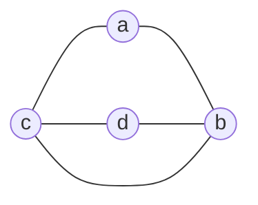
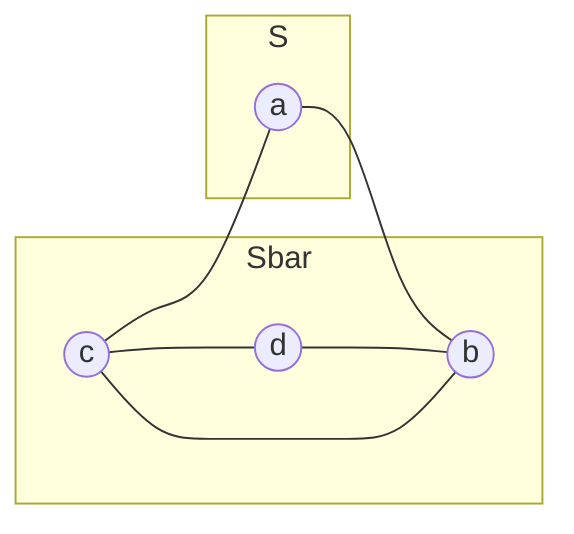
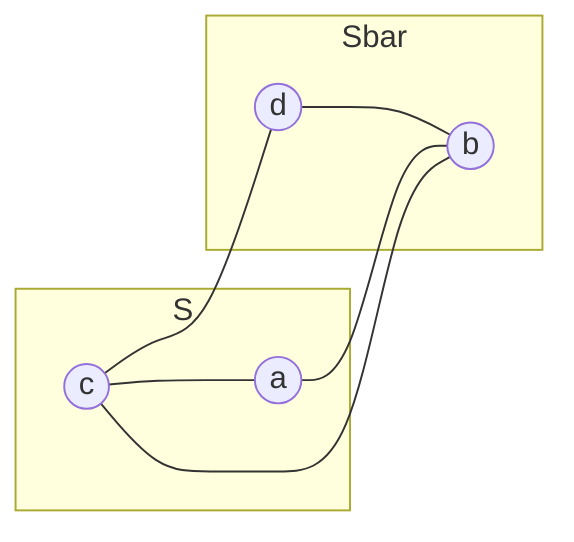
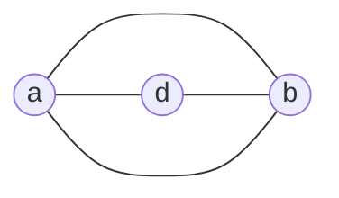
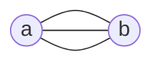
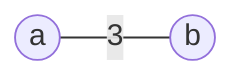

Data Structure and Algorithms

Ursinus College, Spring 2020

Alvin Grissom II

# Programming Assignment 4: Karger-Stein Algorithm for Min-cut

For this assignment, you will work with a randomized algorithm for calculating min-cut, called Karger's algorithm.   

## Edge Contraction

Recall that, given of a graph $G=<V, E>$, a **cut** of $G$ is a partition of the vertices into two sets, $S$ and $\bar{S}$.  The weight of the cut is the sum of the edges connecting the vertices in $S$ and $\bar{S}$.  

For example, consider the following graph:




If we draw a line between ${A}$ and $\{C, D, B\}$, we have a cut with a weight of 2, because there are two edges connecting the the first set of vertices to the other.  



Another possible cut is $\{a, c\}$ and $\{b, d\}$, which has  a value of 3.



While there are several deterministic algorithms for solving this problem, we will consider a **randomized** algorithm, called Karger's Algorithm.  The key operation in Karger's algorithm is that of **edge contraction**.  An edge contraction removes an edge from the graph and redirects the edges of the edge's adjacent nodes to a new vertex, which "absorbs" edges that were incident to the contracted edge.  

For example, consider the first graph above.  Suppose that we contract the edge $AC$.  When we remove $AC$ the edges of vertex $a$ and vertex $c$ need somewhere to go; so, we create a new "supernode," $ac$, which is connected the the edges formerly connected to $a$ and $c$.  (We remove any self-loops.)  This is equivalent to either vertex $a$ or vertex $c$ absorbing the edges of the other, so we can keep the name $a$ or $c$ if we like.  Here, we'll call it $a$.




Now, let's contract $AD$.  Node $a$ will absorb the edges of node $d$.



Finally, we're left with two vertices with three edges between them. We call a graph in which we can  have multiple edges connecting two nodes a **multigraph**.  These edges represent one possible cut of the graph--in this case with a value of 3.  The [Stoer-Wagner algorithm](https://en.wikipedia.org/wiki/Stoer%E2%80%93Wagner_algorithm), which is deterministic, also uses edge contraction to find min-cuts.

## Karger's Algorithm

Karger's Algorithm finds min-cuts by repeatedly shrinking the graph through edge contraction until only two vertices remain.  This works because any cut in the contracted graph is also a cut in the original graph.  But unlike the Stoer-Wagner algorithm, Karger's algorithm chooses the edges to contract *randomly*.  We can prove that by randomly contracting the edges in a graph, we find the min-cut with probability greater than equal to $\frac{2}{n(n - 1)}$, which is $\Theta(n^2)$, where $n$ is the number of vertices $\lvert V\rvert$. (See [Success probability of the contraction algorithm](https://en.wikipedia.org/wiki/Karger%27s_algorithm#Success_probability_of_the_contraction_algorithm).)   This is a low probability, but if we re-run an algorithm with a small but reasonable probability of success enough times, the probability that the algorithm succeeds increases substantially. 

If we run the algorithm for $k$ iterations, the probability of success is $\left(\frac{2}{n(n-1)}\right)^k$; so,  the probability of failure is $\left(1 -\frac{2}{n(n-1)}\right)^k$. 

Thus, if we run the algorithm $\frac{n(n-1)}{2}$ times, the probability of failure is $\left(1 -\frac{2}{n(n-1)}\right)^{\frac{n(n-1)}{2}}\leq \frac{1}{e}$.   Therefore, if we run the algorithm $\frac{n (n – 1)}{2}\ln n$ times, the probability of failure is less than or equal to $\left(\frac{1}{e}\right)^{\ln n} = \frac{1}{n}$.  As a result, running Karger's algorithm $O(n^2 \log n)$ times produces a minimum cut with a probability approaching 1. (See ["The Success Probability"](https://web.stanford.edu/class/archive/cs/cs161/cs161.1138/lectures/11/Small11.pdf).)

In practical terms, if we run the algorithm to completion $cn^2$ times, where $c$ is some constant, i.e., $O(n^2)$ times, we  will almost certainly find the minimum cut.  Since one run of Karger's algorithm can be implemented in $O(n^2)$ time, if we run it $O(n^2 \log n)$ times, the total runtime is on the order of $O(n^4 \log n)$. 

```pseudocode
function karger(G, t):
	while G.|V| > t:
		G = contract(G)
	return G.|E|


function mincut(G):
	cuts =[]
	n = G.|V|
	for i in [0...cn^2]:
		cut = karger(copy(G), 2)
		cuts[i] = cut
	return min(cuts);
```


## Edge-weighted Graphs and Digraphs

As noted in their paper, this algorithm can be modified to work on graphs with positive weights because a positive integer weighted edge can be treated as several edges of weight 1.    For example, we can consider the weighted graph below to be equivalent to the unweighted multigraph with three edges.





When we do the contraction, we can then sum the weights of the edges that are contracted and add them to the edge of the supernode, which is equivalent to contracting each unweighted edge in the multigraph.  Likewise, having directed edges does not change the calculus of the mincut.


## Karger-Stein Algorithm

The Karger-Stein algorithm is an improved version of Karger's Algorithm that achieves $O(n^2 \log{n})$ time.  With Karger's algorithm, we need to repeat the core loop $\Omega(n^2)$ times to achieve a sufficiently high probability of finding the smallest cut. The key insight of Karger-Stein is that **there's a greater probability of contracting a suboptimal edge when the graph has already been significantly contracted.**  


```pseudocode
function fastMincut(G):
	cut = infinity
	if G.|V| < 6:
		cut = mincut(copy(G)) 
		//run normal mincut on small graph
	else
		t = G.|V|/sqrt(2) + 1
		//run mincut until t nodes remain, twice
		G1 = karger(copy(G), t)
		G2 = karger(copy(G), t)
		cut1 = fastMincut(copy(G1))
        cut2 = fastMincut(copy(G2))
        cut = min(cut1, cut2)
	return cut
```

The `fastMincut` function makes two copies of the graph with each recursive call--first 2, then 4, 8, etc--, just as in Merge Sort.  As the graph contracts, we increase the number of copies of each of the smaller graphs through the recursion, i.e., the number of copies of the graph is inversely proportional to the graph's size at a given step.  Since the probability of failure is increased when the graph is smaller, by having multiple copies of the graph, we can counter this, increasing the probability that one of the copies finds the mincut.  See [Section 1.2 here](https://courses.cs.washington.edu/courses/cse521/16sp/521-lecture-1.pdf).  The end result is an $O(n^2 \log^3 {n})$ algorithm, a vast improvement over the original algorithm.

## Parallelization

### Karger's Algorithm

Parallelization of Karger's algorithm is simple.  As [Karger and Stein note](https://dl.acm.org/doi/pdf/10.1145/234533.234534)  in Section 6.3 of their paper:

> Parallelizing the previous algorithms is simple. To generate the permutation, given a list of edges, we simply assign one processor to each edge and have it generate the (approximately) exponentially distributed score for that edge in polylogarithmic time. We then use a parallel sorting algorithm on the resulting scores.

In practical terms for a multi-core machine, since each instance of `contract` uses its own copy of the graph, we can run simply assign each run of `mincut` its own thread.   

### Karger-Stein Algorithm

Parallelization of the Karger-Stein algorithm can be done in the fork-join framework in a manner similar to Merge Sort.  Like Merge Sort, there are two recursive calls on the same data structure.

## Assignment

This assignment is 100 points, but it is possible to earn more.

You have been provided with Java code for the basic Karger's algorithm (using a [version written in C at GeeksforGeeks](https://www.geeksforgeeks.org/kargers-algorithm-for-minimum-cut-set-1-introduction-and-implementation/)  as a reference -- see the link for a basic explanation of the logic, but it's not necessary to understand the details of the contraction implementation for this assignment.)  Run it on one of the provided graphs to get a feel for what to expect.

### Add support for edge-weighted graphs. (10pts)

The current implementation assumes an unweighted graph (in which all edges have a weight of 1).  The `Edge` class already stores the weight data for the graph read in from `stdin`.  Instead of counting removed edges, sum up removed weights.  This is a one-line change.

### Implement `mincut()` (20pts)

Much of the code here is irrelevant to the assignment, so feel free to ignore the gritty details of the union-find implementation of edge contraction.  What you need to know is that each `Graph` has a `vertices` variable that is decremented whenever a contraction is done, but the number of contracted edges is local to the `karger()` function (independent of the graph).

Currently, the algorithm only runs once once, yielding a low probability of success.  It needs to run $cn^2$ times, where $c$ is some constant, to achieve a high probability of success.  To do this, write the appropriate loop inside of a function called `mincut(Graph g)`.

Remember to work with a *copy* of the original graph by using the provided copy constructor.  Each `Graph` object stores a copy of its vertex contraction history.   

### Parallelize `mincut()` (20pts)

As in the matrix multiplication assignment, this is easily parallelizable by simply running each instance of `mincut()` in its own thread and waiting for them all to complete with `join()` or an `Executor`.  Modify the class so that it `implements Runnable` and override the `run()` method, which should just call `mincut()` with the appropriate arguments (which should be passed in to the constructor).  

#### Retrieving the values

For the parallelized algorithm, you'll need to store all of the min-cuts of the various runs of `mincut()` and eventually print out the smallest one.  There are several ways of tackling this, but using an `ArrayList` is not recommended, since they are not thread safe by default. Fortunately, Java provides a thread-safe set that will keep all of the items sorted, called [java.util.concurrent.ConcurrencySkipListSet](https://docs.oracle.com/javase/7/docs/api/java/util/concurrent/ConcurrentSkipListSet.html).  We don't care about duplicates in this case, so a `Set` is appropriate.  Just keep a reference to this list in every instance of the class and add the smallest cut of each run once it has completed.  The minimum of all of these runs will be the min-cut (provided that the algorithm was successful).  (It's also possible to use a basic array by designating each element in the array to store the smallest cut for a given instance, to wrap an `List` in `java.util.Collections.synchronizedList()`, or to use a `CopyOnWriteArrayList`.)


### Implement Karger-Stein  (30pts)

* Write the function `fastKarger()`.  This function is almost exactly the same as `karger()`, but instead of stopping at 2 it stops at t.  (You may simply modify the original function.  In the pseudocode above, it is simply called `karger()`).

* Then write the function `fastMincut()`. Remember to use copies of the graph and not the original.

* Parallelize `fastMintcut()`.  You can do this by extending `RecursiveAction` and calling `fastMinCut()` inside of `compute()`, which you must override.  (Recall that `compute()` is used by classes that extend`RecursiveAction` but `run()` is used by classes that implement `Runnable`.)  Just as in the Merge Sort assignment, you can call `invokeAll()`.  If you prefer, you may write `fastMincut()` and `mincut` in different Java files and classes.  You can use the same `ConcurrencySkipList` to store the cuts and share it among the threads.

### Report (30pts)

Write a report of the same form as those you've written throughout the semester.

* Empirically analyze time complexity as the size of the graph grows.  Be sure to specify how you're defining "size."  The size of the graph to analyze is up to you, but if your largest *n* isn't taking at least 30 seconds, the graph size isn't sufficiently large for the analysis portion this assignment.   Include analyses for at least one multithreaded approach for full credit.  
* Analyze the runtime on the provided graphs from the book's web site: https://algs4.cs.princeton.edu/43mst/  (`tinyEWG.txt`, `mediumEWG.txt`, `1000EWG.txt`, etc.).  You may also want to compare the results to the [provided Stoer-Wagner min-cut algorithm](https://algs4.cs.princeton.edu/code/edu/princeton/cs/algs4/GlobalMincut.java.html) to verify that they are correct.  (E.g., `tinyEWG.txt` has a min weight of 0.95) and `mediumEWG.txt` has a min weight of 0.14021.  I recommend starting with `tinyEWG.txt`.)
* Make some hypotheses (and conclusions, if they're warranted) about the behavior of the graphs and why they behave the way they do. 
* I have provided simple code to generate random graphs of a given size.  If you want to do a more thorough analysis, you can tweak the ratio of edges to vertices to make more dense or sparse graphs.
* Describe any difficulties you did or did not overcome when working on this assignment.
* If there is a particular question you'd like to investigate instead of the ones described her, or you would like to do extra credit, contact me.


## Useful Utility Functions

I have provided some functions to make debugging easier.

* `toMermaid()` will output the the text for a Markdown file with a Mermaid visualization of a graph which can be opened in Typora.

* `toGraphViz()` will output the text for a `.dot` file, which can be rendered with GraphViz.  These graphs are generally more aesthetically pleasing and readable for mathematical graphs.  These can be rendered with the `dot` program included with GraphViz or with some online GraphViz renderers, such as [WebGraphViz](http://www.webgraphviz.com/).

  