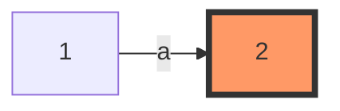
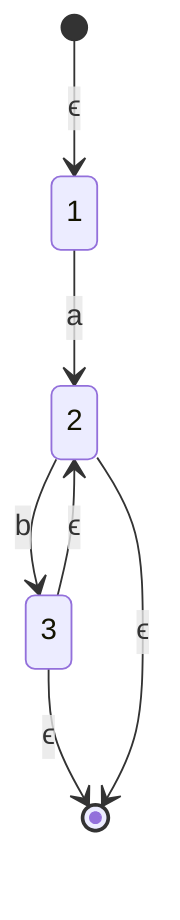

Computational Linguistics Primer

Alvin Grissom II

# Regular Expressions and Regular Languages

Pattern matching in text is a problem as old as computer science.  As such, we have devised a number of clever methods for recognizing patterns.  One of the most well-known of these is the regular expression.

Suppose that we have a text document. From this document, we would like to automatically extract all of the dates, which we know follow this format:

```
2020-03-24
1996-04-09
1995-12-03
```

This is the familiar YYYY-MM-DD format, where we have four digits for the day, two for the month, and two for the day, all separated by a dash.  We could write code to detect such instances using standard control structures in a high-level language.  (How would you do so efficiently?)

Regular expressions, however, provide a convenient syntax for describing the patterns we would like to match.  Regular expressions use a set of operators.  In practice, the exact symbols used in certain to represent these may vary by programming language.  For now, we'll use mathematical syntax.  A regular expression describes a **set of strings** that the regular expression **recognizes**.  Formally, in the theory of computation, a set of strings is called a **language**.  Thus, the regular expression recognizes a language.  The set of languages that can be recognized by regular expressions is called the **regular languages**. We can describe this set of languages with only three operations, called the **regular operations**, which work on sets.

| Operator      | Symbol* | Description                                         |
| ------------- | ------- | --------------------------------------------------- |
| Concatenation | $\circ$ | $a\circ b$ means b must follow a; often written ab. |
| Union         | $\cup$  | Combine languages $L_1$ and $L_2$                   |
| Star          | *       | A* recognizes A repeated 0 or more times            |

The concatenation symbol is usually omitted.  Every language has an **alphabet**, $\Sigma$, a set of symbols allowed in the language.  For the empty string, we'll use $\epsilon$, a lower-case epsilon.  

Let's examine some examples of simple languages.  We'll use parentheses to block off substrings.  Each letter is actually set of symbols, but we'll omit the braces for convenience and readability.  For example, $a$ is $\{a\}$, and $a^*$ is $\{a\}^*$. 

| Regular Language    | Examples                             | Description                                   |
| ------------------- | ------------------------------------ | --------------------------------------------- |
| $L_1 = {a}$         | a                                    | a                                             |
| $L_2 = {ab}$        | ab                                   | ab                                            |
| $L_3 = {ab*}$       | a, ab, abb, abbb                     | a, followed by 0 or more b's                  |
| $L_4 = {(ab)*}$     | $\epsilon$, ab, abab, ababab         | ab repeated 0 or more times                   |
| $L_5 = a \cup b$    | a, b                                 | a or b                                        |
| $L_6$ = $a \cup b$* | $\epsilon$, a, b, bb, bbb            | a, or any number of b's                       |
| $L_7 = a \cup bb*$  | a, b, bb, bbb                        | a or 1 or more b's                            |
| $L_8 =L_1\cup L_2$  | a, ab                                | a or ab                                       |
| $L_9 = L_8^*$       | {$\epsilon$, a, ab, aab, aba, ababa} | Strings from {a, ab} repeated 0 or more times |
|                     |                                      |                                               |

These three operations are sufficient to construct any regular expression that recognizes a particular language.  However, we often use a few others as shorthand to make simpler syntax possible.  The most common addition is the $^+$ operation.  $A^+$ indicates that A can be repeated one or more times.  For example, language $L_7$ would be simpler and more readable with the + operator, $a \cup b^+$.  We also use superscripts to refer to a set being repeated a certain number of times.  For example, $a^5$ is $aaaaa$.

Many programming languages -- including Java, Perl, and Python -- support regular expressions either natively or through external packages. Regular expressions are also used in several widely used Unix programs, such as `grep`, `sed`, and `awk`.  Consult the documentation for given utility for the details on  implementing regular expressions in the language.  Regular expression engines generally support many more operations than the four we have discussed, including logical operators (AND, OR, NOT) and syntax for digits as character ranges.  

For example, in `grep`, we can use `[0-9]` to refer to the set of digits $\{0,1, 2, \ldots, 9\}$.  To match our date string above, we might first try something like this:

```
[0-9][0-9][0-9][0-9]-[0-9][0-9]-[0-9][0-9]"
```

But there are more shortcuts we can use to indicate multiple concatenations in grep syntax.

````
[0-9]\{4\}-[0-9]\{2\}-[0-9]\{2\}"
````

Or suppose that we want to capture a bit of English **morphology**.  Morphology, among other things, is concerned with inflections in language.  Let's take, as an example the word "compute."  Related words include *computer*, *computing*, *computation*, and *computational*.  Let's write a regular expression that would match all of these words but as few others as possible.

```
"comput(er|ation|ational)"
```

If we were actually using `grep`, for example, we would need to escape special characters, like the pipe character `|`, which represents union/logical OR, and the parentheses, so that they would be interpreted as special characters and not as literal characters.  We do this with the backslash character `\`.

```
 grep "comput\(er\|ation\|ational\)"
```

Regular expressions are powerful.  It can be proved that all finite languages are regular.  There are, however, infinitely many non-regular languages.  A commonly used example is the language represented by $a^i b^i$.  There is no regular expression that will recognize this language.

## Equivalence with Finite State Automata

A finite state automaton (FSA) or finite state machine is an abstract computational model consisting of **states** and **transitions**, represented as circles or squares and arrows between them, respectively.  In a deterministic finite state automaton (DFA), at any given time, the machine is in exactly one state, and from this state, the machine can follow the transitions (arrows) from this state to other states.  As a simple example, consider a simple DFA that accepts only the symbol $a$.  




The DFA diagram above starts in state $1$, consumes an $a$, and then ends in state 2, the **accepting state**.  As long as we end in an accepting state, this DFA will recognize the string.

There are also non-deterministic finite state automata (NFAs), which introduce $\epsilon$ transitions, which allow moving to another state by consuming the empty string.  NFAs recognize exactly the same languages as DFAs but are easier to design, so we'll use them instead.  


This NFA recognizes the same language as the DFA above.

Let's design an NFA to recognize $ab^*$.



With NFAs, there only has to exist one possible path of acceptance.  Whenever there is an epsilon transition, we have the option of taking it.  In this example, to recognize the string $abbb$, we proceed as follows:

1. Follow the first epsilon transition.
2. Consume the first $a$, taking us to state 2.
3. Consume the first $b$, taking us to state 3.
4. Follow the epsilon transition back to 2 and repeat step 3 to consume the next two b's.
5. Follow the epsilon transition to the accepting state.

If we cannot reach the accepting state, the string is outside of the language and not recognized by the NFA.  The set of languages recognizable by NFAs, DFAs, and regular languages are equivalent.  Thus, if it's possible to create a regular expression for a set of strings, it's possible to create an NFA for it and vice versa. 